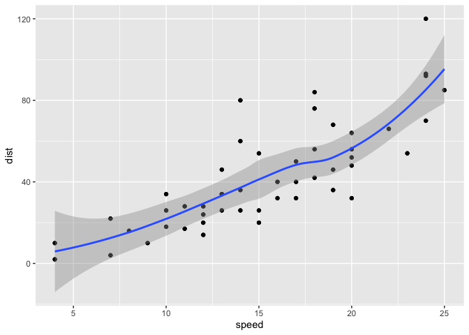
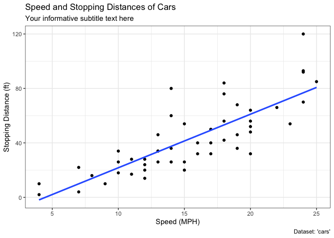
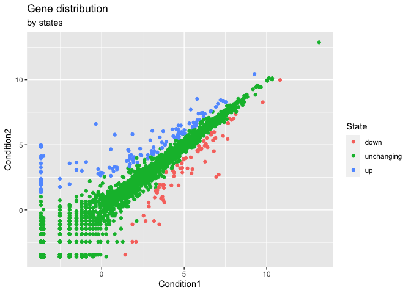
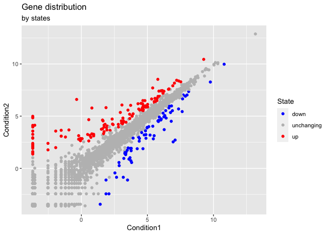
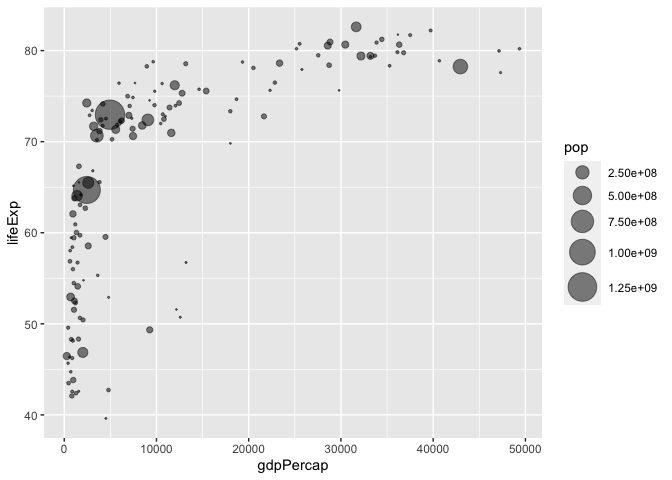
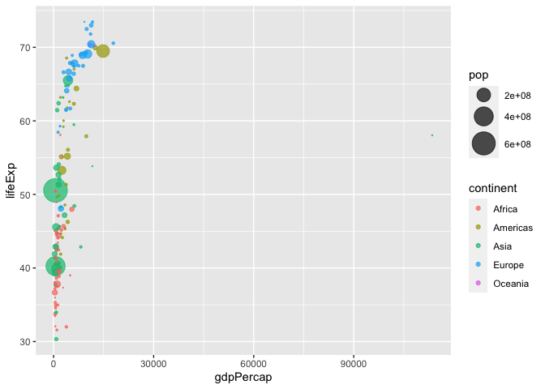
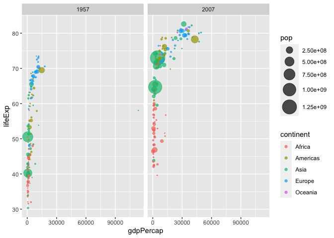

---
author:
- Rita
title: class05
toc-title: Table of contents
---

# Plotting in R

R has the multiple plotting and graphics systems. The most popular of
which is **ggplot2**.

::: cell
``` {.r .cell-code}
plot(cars)
```

::: cell-output-display

:::
:::

ggplot is much more verbose than plot. Need to install the package.

::: cell
``` {.r .cell-code}
# install.packages("ggplot2")
library(ggplot2)

bb <- ggplot(cars, aes(speed, dist)) + geom_point()

bb
```

::: cell-output-display

:::
:::

::: cell
``` {.r .cell-code}
bb +
  aes(x=speed, y=dist) +
  geom_point() +
  geom_smooth()
```

::: {.cell-output .cell-output-stderr}
    `geom_smooth()` using method = 'loess' and formula = 'y ~ x'
:::

::: cell-output-display

:::
:::

ggplot needs three things (data, aes(x,y)) + geom

::: cell
``` {.r .cell-code}
cc<-bb + geom_smooth(method='lm', se=FALSE)
```
:::

::: cell
``` {.r .cell-code}
cc+ labs(title="Speed and Stopping Distances of Cars",
       x="Speed (MPH)", 
       y="Stopping Distance (ft)",
       subtitle = "Your informative subtitle text here",
       caption="Dataset: 'cars'") +
  geom_smooth(method="lm", se=FALSE) +
  theme_bw()
```

::: {.cell-output .cell-output-stderr}
    `geom_smooth()` using formula = 'y ~ x'
    `geom_smooth()` using formula = 'y ~ x'
:::

::: cell-output-display

:::
:::

look at the top rows of the genes dataframe.

::: cell
``` {.r .cell-code}
url<-"https://bioboot.github.io/bimm143_W23/class-material/up_down_expression.txt"
genes<-read.delim(url)

head(genes)
```

::: {.cell-output .cell-output-stdout}
            Gene Condition1 Condition2      State
    1      A4GNT -3.6808610 -3.4401355 unchanging
    2       AAAS  4.5479580  4.3864126 unchanging
    3      AASDH  3.7190695  3.4787276 unchanging
    4       AATF  5.0784720  5.0151916 unchanging
    5       AATK  0.4711421  0.5598642 unchanging
    6 AB015752.4 -3.6808610 -3.5921390 unchanging
:::
:::

plot the data

::: cell
``` {.r .cell-code}
ggplot(genes) + 
    aes(x=Condition1, y=Condition2,color=State) +
    geom_point() +
    labs(title="Gene distribution", subtitle="by states")
```

::: cell-output-display

:::
:::

check the number rows and columns

::: cell
``` {.r .cell-code}
nrow(genes)
```

::: {.cell-output .cell-output-stdout}
    [1] 5196
:::
:::

::: cell
``` {.r .cell-code}
ncol(genes)
```

::: {.cell-output .cell-output-stdout}
    [1] 4
:::
:::

::: cell
``` {.r .cell-code}
table(genes$State)
```

::: {.cell-output .cell-output-stdout}

          down unchanging         up 
            72       4997        127 
:::
:::

::: cell
``` {.r .cell-code}
round( table(genes$State)/nrow(genes) * 100, 2 )
```

::: {.cell-output .cell-output-stdout}

          down unchanging         up 
          1.39      96.17       2.44 
:::
:::

This is the percentage of each categories

::: cell
``` {.r .cell-code}
p<-ggplot(genes) + 
    aes(x=Condition1, y=Condition2,color=State) +
    geom_point() +
    labs(title="Gene distribution", subtitle="by states")

p+scale_colour_manual( values=c("blue","gray","red") )
```

::: cell-output-display

:::
:::

# Extra practice: The gap minder dataset

::: cell
``` {.r .cell-code}
url <- "https://raw.githubusercontent.com/jennybc/gapminder/master/inst/extdata/gapminder.tsv"

gapminder <- read.delim(url)
```
:::

::: cell
``` {.r .cell-code}
library(dplyr)
```

::: {.cell-output .cell-output-stderr}

    Attaching package: 'dplyr'
:::

::: {.cell-output .cell-output-stderr}
    The following objects are masked from 'package:stats':

        filter, lag
:::

::: {.cell-output .cell-output-stderr}
    The following objects are masked from 'package:base':

        intersect, setdiff, setequal, union
:::

``` {.r .cell-code}
gapminder_2007 <- gapminder %>% filter(year==2007)
```
:::

::: cell
``` {.r .cell-code}
ggplot(gapminder_2007) +
  aes(x=gdpPercap, y=lifeExp) +
  geom_point(alpha=0.5)
```

::: cell-output-display

:::
:::

::: cell
``` {.r .cell-code}
ggplot(gapminder_2007) + 
  geom_point(aes(x = gdpPercap, y = lifeExp,
                 size = pop), alpha=0.5) + 
  scale_size_area(max_size = 10)
```

::: cell-output-display

:::
:::

::: cell
``` {.r .cell-code}
gapminder_1957 <- gapminder %>% filter(year==1957)

ggplot(gapminder_1957) + 
  aes(x = gdpPercap, y = lifeExp, color=continent,
                 size = pop) +
  geom_point(alpha=0.7) + 
  scale_size_area(max_size = 10) 
```

::: cell-output-display

:::
:::

::: cell
``` {.r .cell-code}
gapminder_1957 <- gapminder %>% filter(year==1957 | year==2007)

ggplot(gapminder_1957) + 
  geom_point(aes(x = gdpPercap, y = lifeExp, color=continent,
                 size = pop), alpha=0.7) + 
  scale_size_area(max_size = 10) +
  facet_wrap(~year)
```

::: cell-output-display

:::
:::
