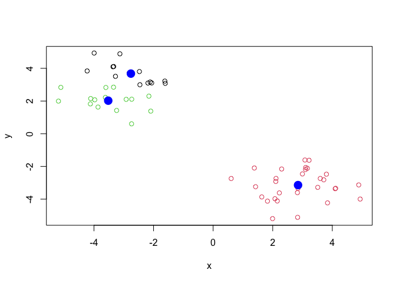
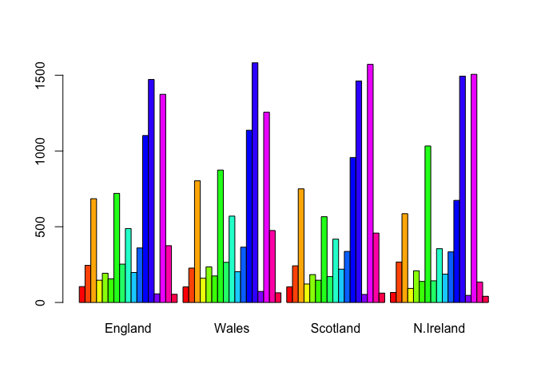
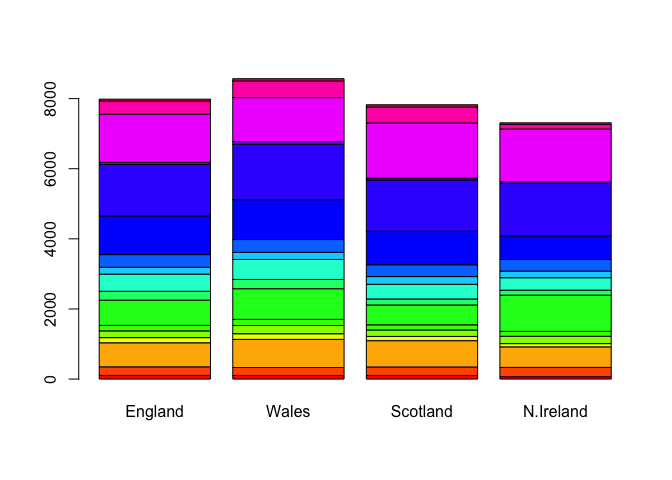

---
author:
- Xinlong Wan
title: lab07
toc-title: Table of contents
---

## kmeans

::: cell
``` {.r .cell-code}
hist(rnorm(30, -3))
```

::: cell-output-display

:::
:::

::: cell
``` {.r .cell-code}
tmp <- c(rnorm(30, -3), rnorm(30, +3))
x <- cbind(x=tmp, y=rev(tmp))
head(x)
```

::: {.cell-output .cell-output-stdout}
                 x        y
    [1,] -3.129846 4.886759
    [2,] -2.918487 2.102600
    [3,] -3.863566 1.632074
    [4,] -3.601575 2.828658
    [5,] -5.112548 2.835531
    [6,] -2.733097 2.110413
:::
:::

::: cell
``` {.r .cell-code}
plot(x)
```

::: cell-output-display

:::
:::

Use the kmeans function

::: cell
``` {.r .cell-code}
km <- kmeans(x, centers=2, nstart=20)
km
```

::: {.cell-output .cell-output-stdout}
    K-means clustering with 2 clusters of sizes 30, 30

    Cluster means:
              x         y
    1  2.849986 -3.140668
    2 -3.140668  2.849986

    Clustering vector:
     [1] 2 2 2 2 2 2 2 2 2 2 2 2 2 2 2 2 2 2 2 2 2 2 2 2 2 2 2 2 2 2 1 1 1 1 1 1 1 1
    [39] 1 1 1 1 1 1 1 1 1 1 1 1 1 1 1 1 1 1 1 1 1 1

    Within cluster sum of squares by cluster:
    [1] 56.21409 56.21409
     (between_SS / total_SS =  90.5 %)

    Available components:

    [1] "cluster"      "centers"      "totss"        "withinss"     "tot.withinss"
    [6] "betweenss"    "size"         "iter"         "ifault"      
:::
:::

::: cell
``` {.r .cell-code}
# play with kmeans and ask for different number of clusters

km <- kmeans(x, centers=3, nstart=20)
plot(x, col=km$cluster)
points(km$centers, col="blue", pch=16, cex=2)
```

::: cell-output-display

:::
:::

## Hierarchical clustering

::: cell
``` {.r .cell-code}
d <- dist(x)
hc <- hclust(d)

hc
```

::: {.cell-output .cell-output-stdout}

    Call:
    hclust(d = d)

    Cluster method   : complete 
    Distance         : euclidean 
    Number of objects: 60 
:::
:::

There is a plot method for hclust result.

::: cell
``` {.r .cell-code}
plot(hc)
abline(h=10, col='red')
```

::: cell-output-display

:::
:::

To get all the members of a given cluster residing in the same cut
branch.

::: cell
``` {.r .cell-code}
cut_hc <- cutree(hc, h=10)
cut_hc
```

::: {.cell-output .cell-output-stdout}
     [1] 1 1 1 1 1 1 1 1 1 1 1 1 1 1 1 1 1 1 1 1 1 1 1 1 1 1 1 1 1 1 2 2 2 2 2 2 2 2
    [39] 2 2 2 2 2 2 2 2 2 2 2 2 2 2 2 2 2 2 2 2 2 2
:::
:::

::: cell
``` {.r .cell-code}
plot(x, col=cut_hc)
```

::: cell-output-display

:::
:::

It is often helpful to use "k" instead of "h=" in cutree.

::: cell
``` {.r .cell-code}
cutree(hc, k=4)
```

::: {.cell-output .cell-output-stdout}
     [1] 1 2 1 1 1 2 1 1 2 2 2 2 2 2 1 2 1 1 1 2 1 2 1 1 1 1 2 1 1 1 3 3 3 4 3 3 3 3
    [39] 4 3 4 3 3 3 4 3 4 4 4 4 4 4 3 3 4 3 3 3 4 3
:::
:::

# PCA

::: cell
``` {.r .cell-code}
url <- "https://tinyurl.com/UK-foods"
x <- read.csv(url)
```
:::

::: cell
``` {.r .cell-code}
ncol(x)
```

::: {.cell-output .cell-output-stdout}
    [1] 5
:::

``` {.r .cell-code}
nrow(x)
```

::: {.cell-output .cell-output-stdout}
    [1] 17
:::
:::

> Q1. 5 columns 17 rows.

::: cell
``` {.r .cell-code}
#View(head(x, 6))
head(x,6)
```

::: {.cell-output .cell-output-stdout}
                   X England Wales Scotland N.Ireland
    1         Cheese     105   103      103        66
    2  Carcass_meat      245   227      242       267
    3    Other_meat      685   803      750       586
    4           Fish     147   160      122        93
    5 Fats_and_oils      193   235      184       209
    6         Sugars     156   175      147       139
:::
:::

::: cell
``` {.r .cell-code}
# change the index to first column

rownames(x) <- x[,1]
x <- x[,-1]
head(x)
```

::: {.cell-output .cell-output-stdout}
                   England Wales Scotland N.Ireland
    Cheese             105   103      103        66
    Carcass_meat       245   227      242       267
    Other_meat         685   803      750       586
    Fish               147   160      122        93
    Fats_and_oils      193   235      184       209
    Sugars             156   175      147       139
:::

``` {.r .cell-code}
dim(x)
```

::: {.cell-output .cell-output-stdout}
    [1] 17  4
:::
:::

::: cell
``` {.r .cell-code}
x <- read.csv(url, row.names=1)
head(x)
```

::: {.cell-output .cell-output-stdout}
                   England Wales Scotland N.Ireland
    Cheese             105   103      103        66
    Carcass_meat       245   227      242       267
    Other_meat         685   803      750       586
    Fish               147   160      122        93
    Fats_and_oils      193   235      184       209
    Sugars             156   175      147       139
:::
:::

> Q2. the second approach is more robust. Since we don't need to
> reassign x. And we can have two dataset from the same url but with
> different columns as rownames.

Visualize the data

::: cell
``` {.r .cell-code}
barplot(as.matrix(x), beside=T, col=rainbow(nrow(x)))
```

::: cell-output-display

:::
:::

> Q3. \# change the beside to False to get a stacked barplot

::: cell
``` {.r .cell-code}
barplot(as.matrix(x), beside=F, col=rainbow(nrow(x)))
```

::: cell-output-display

:::
:::

::: cell
``` {.r .cell-code}
x$color <- rainbow(nrow(x))

pairs(x[, 1:4], col=x$color, pch=16)
par(xpd=TRUE)
legend("topleft", fill = unique(x$color), legend = c( rownames(x) ), cex=0.2)
```

::: cell-output-display

:::
:::

> Q5. It makes pairwise comparison of each combination. plot(2,3) is
> comparing Wales and Scotland for the prize of each different food
> type. Points on diagonal mean the prize of that specific food cost the
> same in the two countries in comparison.

> Q6. Certain food is higher in N. Ireland. But it's generally hard to
> compare.

## Use the PCA on the dataset

::: cell
``` {.r .cell-code}
x <- x[, 1:4]

pca <- prcomp(t(x))
summary(pca)
```

::: {.cell-output .cell-output-stdout}
    Importance of components:
                                PC1      PC2      PC3       PC4
    Standard deviation     324.1502 212.7478 73.87622 5.552e-14
    Proportion of Variance   0.6744   0.2905  0.03503 0.000e+00
    Cumulative Proportion    0.6744   0.9650  1.00000 1.000e+00
:::

``` {.r .cell-code}
head(pca)
```

::: {.cell-output .cell-output-stdout}
    $sdev
    [1] 3.241502e+02 2.127478e+02 7.387622e+01 5.551558e-14

    $rotation
                                 PC1          PC2         PC3          PC4
    Cheese              -0.056955380 -0.016012850 -0.02394295 -0.537717586
    Carcass_meat         0.047927628 -0.013915823 -0.06367111  0.827327785
    Other_meat          -0.258916658  0.015331138  0.55384854 -0.054885657
    Fish                -0.084414983  0.050754947 -0.03906481 -0.017195729
    Fats_and_oils       -0.005193623  0.095388656  0.12522257  0.039441462
    Sugars              -0.037620983  0.043021699  0.03605745  0.002788534
    Fresh_potatoes       0.401402060  0.715017078  0.20668248 -0.030319813
    Fresh_Veg           -0.151849942  0.144900268 -0.21382237 -0.051070911
    Other_Veg           -0.243593729  0.225450923  0.05332841  0.060355222
    Processed_potatoes  -0.026886233 -0.042850761  0.07364902  0.003645959
    Processed_Veg       -0.036488269  0.045451802 -0.05289191 -0.003672450
    Fresh_fruit         -0.632640898  0.177740743 -0.40012865  0.031359988
    Cereals             -0.047702858  0.212599678  0.35884921  0.073618516
    Beverages           -0.026187756  0.030560542  0.04135860 -0.005163295
    Soft_drinks          0.232244140 -0.555124311  0.16942648 -0.009904437
    Alcoholic_drinks    -0.463968168 -0.113536523  0.49858320  0.088180533
    Confectionery       -0.029650201 -0.005949921  0.05232164  0.004029923

    $center
                 Cheese       Carcass_meat          Other_meat                 Fish 
                  94.25              245.25              706.00              130.50 
         Fats_and_oils               Sugars     Fresh_potatoes           Fresh_Veg  
                 205.25              154.25              798.25              208.00 
             Other_Veg  Processed_potatoes       Processed_Veg         Fresh_fruit  
                 457.75              202.00              349.00              967.50 
               Cereals            Beverages        Soft_drinks    Alcoholic_drinks  
                1502.50               57.50             1427.00              360.75 
         Confectionery  
                  55.25 

    $scale
    [1] FALSE

    $x
                     PC1         PC2         PC3           PC4
    England   -144.99315    2.532999 -105.768945  1.042460e-14
    Wales     -240.52915  224.646925   56.475555  9.556806e-13
    Scotland   -91.86934 -286.081786   44.415495 -1.257152e-12
    N.Ireland  477.39164   58.901862    4.877895  2.872787e-13
:::
:::

> Q7

::: cell
``` {.r .cell-code}
plot(pca$x[,1], pca$x[,2], xlab="PC1", ylab="PC2", xlim=c(-270,500))
text(pca$x[,1], pca$x[,2], colnames(x))
```

::: cell-output-display

:::
:::

> Q8.

::: cell
``` {.r .cell-code}
plot(pca$x[,1], pca$x[,2], xlab="PC1", ylab="PC2", xlim=c(-270,500), pch=15,
     col=c('orange', 'red', 'blue', 'darkgreen'))
text(pca$x[,1], pca$x[,2], colnames(x), col=c('orange', 'red', 'blue', 'darkgreen'))
```

::: cell-output-display

:::
:::

::: cell
``` {.r .cell-code}
v <- round( pca$sdev^2/sum(pca$sdev^2) * 100 )
v
```

::: {.cell-output .cell-output-stdout}
    [1] 67 29  4  0
:::
:::

::: cell
``` {.r .cell-code}
z <- summary(pca)
z$importance
```

::: {.cell-output .cell-output-stdout}
                                 PC1       PC2      PC3          PC4
    Standard deviation     324.15019 212.74780 73.87622 5.551558e-14
    Proportion of Variance   0.67444   0.29052  0.03503 0.000000e+00
    Cumulative Proportion    0.67444   0.96497  1.00000 1.000000e+00
:::
:::

::: cell
``` {.r .cell-code}
barplot(v, xlab="Principal Component", ylab="Percent Variation")
```

::: cell-output-display

:::
:::

The first two PCs capture most of the variance.

::: cell
``` {.r .cell-code}
# visualize the loading for each variables in PC1.
par(mar=c(10, 3, 0.35, 0))
barplot( pca$rotation[,1], las=2 )
```

::: cell-output-display

:::
:::

> Q9

::: cell
``` {.r .cell-code}
# loading in second PC
par(mar=c(10, 3, 0.35, 0))
barplot( pca$rotation[,2], las=2 )
```

::: cell-output-display

:::
:::
