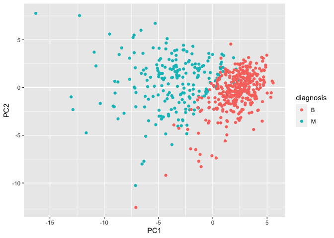

# Import the data

::: cell
``` {.r .cell-code}
fna.data <- "WisconsinCancer.csv"
wisc.df <- read.csv(fna.data, row.names=1)

head(wisc.df, 3)
```

::: {.cell-output .cell-output-stdout}
             diagnosis radius_mean texture_mean perimeter_mean area_mean
    842302           M       17.99        10.38          122.8      1001
    842517           M       20.57        17.77          132.9      1326
    84300903         M       19.69        21.25          130.0      1203
             smoothness_mean compactness_mean concavity_mean concave.points_mean
    842302           0.11840          0.27760         0.3001             0.14710
    842517           0.08474          0.07864         0.0869             0.07017
    84300903         0.10960          0.15990         0.1974             0.12790
             symmetry_mean fractal_dimension_mean radius_se texture_se perimeter_se
    842302          0.2419                0.07871    1.0950     0.9053        8.589
    842517          0.1812                0.05667    0.5435     0.7339        3.398
    84300903        0.2069                0.05999    0.7456     0.7869        4.585
             area_se smoothness_se compactness_se concavity_se concave.points_se
    842302    153.40      0.006399        0.04904      0.05373           0.01587
    842517     74.08      0.005225        0.01308      0.01860           0.01340
    84300903   94.03      0.006150        0.04006      0.03832           0.02058
             symmetry_se fractal_dimension_se radius_worst texture_worst
    842302       0.03003             0.006193        25.38         17.33
    842517       0.01389             0.003532        24.99         23.41
    84300903     0.02250             0.004571        23.57         25.53
             perimeter_worst area_worst smoothness_worst compactness_worst
    842302             184.6       2019           0.1622            0.6656
    842517             158.8       1956           0.1238            0.1866
    84300903           152.5       1709           0.1444            0.4245
             concavity_worst concave.points_worst symmetry_worst
    842302            0.7119               0.2654         0.4601
    842517            0.2416               0.1860         0.2750
    84300903          0.4504               0.2430         0.3613
             fractal_dimension_worst
    842302                   0.11890
    842517                   0.08902
    84300903                 0.08758
:::
:::

::: cell
``` {.r .cell-code}
# remove first column
wisc.data <- wisc.df[,-1]
```
:::

::: cell
``` {.r .cell-code}
# Create diagnosis vector for later
diagnosis <- factor(wisc.df$diagnosis)
```
:::

> Q1. How many observations are in this dataset?

::: cell
``` {.r .cell-code}
print(paste(nrow(wisc.df), "observation"))
```

::: {.cell-output .cell-output-stdout}
    [1] "569 observation"
:::
:::

> Q2. How many of the observations have a malignant diagnosis?

::: cell
``` {.r .cell-code}
print(paste(nrow(wisc.df[wisc.df$diagnosis=="M",]), 'malignant diagnosis'))
```

::: {.cell-output .cell-output-stdout}
    [1] "212 malignant diagnosis"
:::
:::

> Q3 How many variables/features in the data are suffixed with \_mean?

::: cell
``` {.r .cell-code}
length(grep("_mean$", colnames(wisc.df)))
```

::: {.cell-output .cell-output-stdout}
    [1] 10
:::
:::

# PCA

::: cell
``` {.r .cell-code}
# Check column means and standard deviations
colMeans(wisc.data)
```

::: {.cell-output .cell-output-stdout}
                radius_mean            texture_mean          perimeter_mean 
               1.412729e+01            1.928965e+01            9.196903e+01 
                  area_mean         smoothness_mean        compactness_mean 
               6.548891e+02            9.636028e-02            1.043410e-01 
             concavity_mean     concave.points_mean           symmetry_mean 
               8.879932e-02            4.891915e-02            1.811619e-01 
     fractal_dimension_mean               radius_se              texture_se 
               6.279761e-02            4.051721e-01            1.216853e+00 
               perimeter_se                 area_se           smoothness_se 
               2.866059e+00            4.033708e+01            7.040979e-03 
             compactness_se            concavity_se       concave.points_se 
               2.547814e-02            3.189372e-02            1.179614e-02 
                symmetry_se    fractal_dimension_se            radius_worst 
               2.054230e-02            3.794904e-03            1.626919e+01 
              texture_worst         perimeter_worst              area_worst 
               2.567722e+01            1.072612e+02            8.805831e+02 
           smoothness_worst       compactness_worst         concavity_worst 
               1.323686e-01            2.542650e-01            2.721885e-01 
       concave.points_worst          symmetry_worst fractal_dimension_worst 
               1.146062e-01            2.900756e-01            8.394582e-02 
:::

``` {.r .cell-code}
round(apply(wisc.data,2,sd), 2)
```

::: {.cell-output .cell-output-stdout}
                radius_mean            texture_mean          perimeter_mean 
                       3.52                    4.30                   24.30 
                  area_mean         smoothness_mean        compactness_mean 
                     351.91                    0.01                    0.05 
             concavity_mean     concave.points_mean           symmetry_mean 
                       0.08                    0.04                    0.03 
     fractal_dimension_mean               radius_se              texture_se 
                       0.01                    0.28                    0.55 
               perimeter_se                 area_se           smoothness_se 
                       2.02                   45.49                    0.00 
             compactness_se            concavity_se       concave.points_se 
                       0.02                    0.03                    0.01 
                symmetry_se    fractal_dimension_se            radius_worst 
                       0.01                    0.00                    4.83 
              texture_worst         perimeter_worst              area_worst 
                       6.15                   33.60                  569.36 
           smoothness_worst       compactness_worst         concavity_worst 
                       0.02                    0.16                    0.21 
       concave.points_worst          symmetry_worst fractal_dimension_worst 
                       0.07                    0.06                    0.02 
:::

``` {.r .cell-code}
# so it's important to scale the data during pca
```
:::

::: cell
``` {.r .cell-code}
# Perform PCA on wisc.data by completing the following code
wisc.pr <- prcomp(wisc.data, scale=TRUE)
# Look at summary of results
summary(wisc.pr)
```

::: {.cell-output .cell-output-stdout}
    Importance of components:
                              PC1    PC2     PC3     PC4     PC5     PC6     PC7
    Standard deviation     3.6444 2.3857 1.67867 1.40735 1.28403 1.09880 0.82172
    Proportion of Variance 0.4427 0.1897 0.09393 0.06602 0.05496 0.04025 0.02251
    Cumulative Proportion  0.4427 0.6324 0.72636 0.79239 0.84734 0.88759 0.91010
                               PC8    PC9    PC10   PC11    PC12    PC13    PC14
    Standard deviation     0.69037 0.6457 0.59219 0.5421 0.51104 0.49128 0.39624
    Proportion of Variance 0.01589 0.0139 0.01169 0.0098 0.00871 0.00805 0.00523
    Cumulative Proportion  0.92598 0.9399 0.95157 0.9614 0.97007 0.97812 0.98335
                              PC15    PC16    PC17    PC18    PC19    PC20   PC21
    Standard deviation     0.30681 0.28260 0.24372 0.22939 0.22244 0.17652 0.1731
    Proportion of Variance 0.00314 0.00266 0.00198 0.00175 0.00165 0.00104 0.0010
    Cumulative Proportion  0.98649 0.98915 0.99113 0.99288 0.99453 0.99557 0.9966
                              PC22    PC23   PC24    PC25    PC26    PC27    PC28
    Standard deviation     0.16565 0.15602 0.1344 0.12442 0.09043 0.08307 0.03987
    Proportion of Variance 0.00091 0.00081 0.0006 0.00052 0.00027 0.00023 0.00005
    Cumulative Proportion  0.99749 0.99830 0.9989 0.99942 0.99969 0.99992 0.99997
                              PC29    PC30
    Standard deviation     0.02736 0.01153
    Proportion of Variance 0.00002 0.00000
    Cumulative Proportion  1.00000 1.00000
:::
:::

> Q4. From your results, what proportion of the original variance is
> captured by the first principal components (PC1)?

::: cell
``` {.r .cell-code}
print(paste(round((summary(wisc.pr)[[1]][1]^2 / sum(summary(wisc.pr)[[1]]^2)) * 100, 2), "%", sep=""))
```

::: {.cell-output .cell-output-stdout}
    [1] "44.27%"
:::
:::

> Q5. How many principal components (PCs) are required to describe at
> least 70% of the original variance in the data?

::: cell
``` {.r .cell-code}
sde <- summary(wisc.pr)[[1]]


n_PC <- function(percentage_variance) {
  for (i in 1:length(sde) ) {
    if ( (sum(sde[1:i]^2) / sum(sde^2)) * 100 >= percentage_variance) {
      break
    }
  }
i
}

print(paste(n_PC(70), "PCs are required"))
```

::: {.cell-output .cell-output-stdout}
    [1] "3 PCs are required"
:::
:::

> Q6. How many principal components (PCs) are required to describe at
> least 90% of the original variance in the data?

::: cell
``` {.r .cell-code}
print(paste(n_PC(90), "PCs are required"))
```

::: {.cell-output .cell-output-stdout}
    [1] "7 PCs are required"
:::
:::

> Q7. What stands out to you about this plot? Is it easy or difficult to
> understand? Why?

::: cell
``` {.r .cell-code}
biplot(wisc.pr)
```

::: cell-output-display

:::
:::

The plot is very crowded and difficult to read. The text overlap with
the points and make the data points unreadable. The length of the red
arrow of each point should represent the weight of each sample
contributing to each features in dimension of first two components.

> Q8

::: cell
``` {.r .cell-code}
# Scatter plot observations by components 1 and 2

plot(wisc.pr$x[, 1:2], col = diagnosis, 
     xlab = "PC1", ylab = "PC2")
```

::: cell-output-display

:::

``` {.r .cell-code}
plot(wisc.pr$x[, c(1,3)], col = diagnosis, 
     xlab = "PC1", ylab = "PC3")
```

::: cell-output-display

:::
:::

The two different diagnosis looks seperated in these plot, suggesting
that PC1 and PC2 or PC1 and PC3 (mostly PC1) captures enough differences
to the extend that the same diagnosis clustered together in the
dimension of only two PCs. It's also much easier to read than the
previous one.

::: cell
``` {.r .cell-code}
# Create a data.frame for ggplot
df <- as.data.frame(wisc.pr$x)
df$diagnosis <- diagnosis

# Load the ggplot2 package
library(ggplot2)

# Make a scatter plot colored by diagnosis
ggplot(df) + 
  aes(PC1, PC2, col=diagnosis) + 
  geom_point()
```

::: cell-output-display

:::
:::

::: cell
``` {.r .cell-code}
pr.var <- wisc.pr$sdev^2
head(pr.var)
```

::: {.cell-output .cell-output-stdout}
    [1] 13.281608  5.691355  2.817949  1.980640  1.648731  1.207357
:::
:::

::: cell
``` {.r .cell-code}
# Variance explained by each principal component: pve
pve <- pr.var / sum(pr.var)

# Plot variance explained for each principal component
plot(pve, xlab = "Principal Component", 
     ylab = "Proportion of Variance Explained", 
     ylim = c(0, 1), type = "o")
```

::: cell-output-display

:::
:::

::: cell
``` {.r .cell-code}
# Alternative scree plot of the same data, note data driven y-axis
barplot(pve, ylab = "Precent of Variance Explained",
     names.arg=paste0("PC",1:length(pve)), las=2, axes = FALSE)
axis(2, at=pve, labels=round(pve,2)*100 )
```

::: cell-output-display

:::
:::

> Q9.

::: cell
``` {.r .cell-code}
wisc.pr$rotation["concave.points_mean",1]
```

::: {.cell-output .cell-output-stdout}
    [1] -0.2608538
:::
:::

> 10. 

::: cell
``` {.r .cell-code}
print(paste(n_PC(80), "PCs are required"))
```

::: {.cell-output .cell-output-stdout}
    [1] "5 PCs are required"
:::
:::

# Hierarchical clustering

::: cell
``` {.r .cell-code}
# Scale the wisc.data data using the "scale()" function
data.scaled <- scale(wisc.data)
# calculate euclidian distance
data.dist <- dist(data.scaled, method = "euclidean")
#clustering
wisc.hclust <- hclust(data.dist, method="complete")
```
:::

> 11. 

::: cell
``` {.r .cell-code}
plot(wisc.hclust)
abline(h=19, col="red", lty=2)
```

::: cell-output-display

:::
:::

The height is 19.

::: cell
``` {.r .cell-code}
wisc.hclust.clusters <- cutree(wisc.hclust, 4)

table(wisc.hclust.clusters, diagnosis)
```

::: {.cell-output .cell-output-stdout}
                        diagnosis
    wisc.hclust.clusters   B   M
                       1  12 165
                       2   2   5
                       3 343  40
                       4   0   2
:::
:::

> 12. 

::: cell
``` {.r .cell-code}
wisc.hclust.clusters <- cutree(wisc.hclust, 6)

table(wisc.hclust.clusters, diagnosis)
```

::: {.cell-output .cell-output-stdout}
                        diagnosis
    wisc.hclust.clusters   B   M
                       1  12 165
                       2   0   5
                       3 331  39
                       4   2   0
                       5  12   1
                       6   0   2
:::
:::

I cannot find a better cut. Anything below 4 will cause majority of B
and M to be clustered together. Anything above 4 will cause smaller
clusters to form that are not obvious representative B or M.

> Q13

::: cell
``` {.r .cell-code}
for (med in c("single", "complete", "average", "ward.D2")) {
  wisc.hclust <- hclust(data.dist, method=med)
  plot(wisc.hclust, sub = paste("clustering by", med))
  wisc.hclust.clusters <- cutree(wisc.hclust, 2)
  print(med)
  print(table(wisc.hclust.clusters, diagnosis))
}
```

::: cell-output-display

:::

::: {.cell-output .cell-output-stdout}
    [1] "single"
                        diagnosis
    wisc.hclust.clusters   B   M
                       1 357 210
                       2   0   2
:::

::: cell-output-display

:::

::: {.cell-output .cell-output-stdout}
    [1] "complete"
                        diagnosis
    wisc.hclust.clusters   B   M
                       1 357 210
                       2   0   2
:::

::: cell-output-display

:::

::: {.cell-output .cell-output-stdout}
    [1] "average"
                        diagnosis
    wisc.hclust.clusters   B   M
                       1 357 209
                       2   0   3
:::

::: cell-output-display

:::

::: {.cell-output .cell-output-stdout}
    [1] "ward.D2"
                        diagnosis
    wisc.hclust.clusters   B   M
                       1  20 164
                       2 337  48
:::
:::

Looks like ward.D2 gives the best result. At only two clusters, it shows
a good cluster vs diagnoses match. The second best is the complete,
which shows apparent match at cluster=4. The other two doesn't show
apparent matches, as the clusters are too stringy and not compact. This
could be because the "single" and "average" methods are affected too
much by the noise to give good matches.

# Combining methods

::: cell
``` {.r .cell-code}
# select principle components

wisc.pr.90 <- wisc.pr$x[, 1:n_PC(90)]

# calculate euclidian distance
wisc.pr.90.dist <- dist(wisc.pr.90, method = "euclidean")

# build clusters
wisc.pr.hclust <- hclust(wisc.pr.90.dist, method="ward.D2")
grps <- cutree(wisc.pr.hclust, k=2)
table(grps)
```

::: {.cell-output .cell-output-stdout}
    grps
      1   2 
    216 353 
:::
:::

::: cell
``` {.r .cell-code}
table(grps, diagnosis)
```

::: {.cell-output .cell-output-stdout}
        diagnosis
    grps   B   M
       1  28 188
       2 329  24
:::
:::

::: cell
``` {.r .cell-code}
plot(wisc.pr$x[,1:2], col=grps)
```

::: cell-output-display

:::
:::

::: cell
``` {.r .cell-code}
plot(wisc.pr$x[,1:2], col=diagnosis)
```

::: cell-output-display

:::
:::

::: cell
``` {.r .cell-code}
g <- as.factor(grps)
levels(g)
```

::: {.cell-output .cell-output-stdout}
    [1] "1" "2"
:::
:::

::: cell
``` {.r .cell-code}
g <- relevel(g,2)
levels(g)
```

::: {.cell-output .cell-output-stdout}
    [1] "2" "1"
:::
:::

::: cell
``` {.r .cell-code}
# Plot using our re-ordered factor 
plot(wisc.pr$x[,1:2], col=g)
```

::: cell-output-display

:::
:::

::: cell
``` {.r .cell-code}
# 3d ploting
library(rgl)
# plot3d(wisc.pr$x[,1:3], xlab="PC 1", ylab="PC 2", zlab="PC 3", cex=1.5, size=1, type="s", col=grps)
# rglwidget(width = 400, height = 400)
```
:::

::: cell
``` {.r .cell-code}
## Use the distance along the first 7 PCs for clustering i.e. wisc.pr$x[, 1:7]

# calculate euclidian distance
wisc.pr.dist <- dist(wisc.pr$x[, 1:7], method = "euclidean")

# build clusters
wisc.pr.hclust <- hclust(wisc.pr.dist, method="ward.D2")

wisc.pr.hclust.clusters <- cutree(wisc.pr.hclust, k=2)


# Compare to actual diagnoses
table(wisc.pr.hclust.clusters, diagnosis)
```

::: {.cell-output .cell-output-stdout}
                           diagnosis
    wisc.pr.hclust.clusters   B   M
                          1  28 188
                          2 329  24
:::
:::

> Q15

The model separated the two diagnoses pretty well. If we assign the
first cluster as "diagnosis M" and the second as "diagnosis B", the fpr
is 0.11 and the fnr is 0.08. The accuracy is 90.9%. It performs better
than ward.D2 without PCA, proving that PCA indeed helps with dimension
reduction and gives us a better model.
