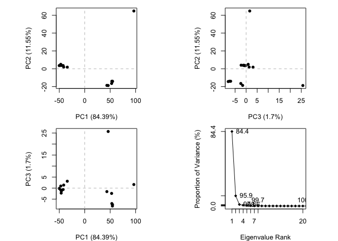
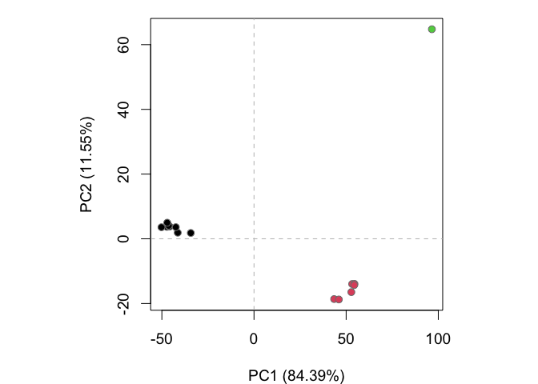

---
author:
- Xinlong Wan
title: class09
toc-title: Table of contents
---

# 1. Protein data bank

::: cell
``` {.r .cell-code}
pdb_df = read.csv("Data Export Summary.csv")
pdb_df
```

::: {.cell-output .cell-output-stdout}
               Molecular.Type   X.ray    EM    NMR Multiple.methods Neutron Other
    1          Protein (only) 152,809 9,421 12,117              191      72    32
    2 Protein/Oligosaccharide   9,008 1,654     32                7       1     0
    3              Protein/NA   8,061 2,944    281                6       0     0
    4     Nucleic acid (only)   2,602    77  1,433               12       2     1
    5                   Other     163     9     31                0       0     0
    6  Oligosaccharide (only)      11     0      6                1       0     4
        Total
    1 174,642
    2  10,702
    3  11,292
    4   4,127
    5     203
    6      22
:::
:::

> Q1.

::: cell
``` {.r .cell-code}
library(stringr)
pdb_df <- as.data.frame(lapply(pdb_df, str_remove, ","))
pdb_df[,-1] <- as.data.frame(lapply(pdb_df[,-1], strtoi))
```
:::

::: cell
``` {.r .cell-code}
pdb_df
```

::: {.cell-output .cell-output-stdout}
               Molecular.Type  X.ray   EM   NMR Multiple.methods Neutron Other
    1          Protein (only) 152809 9421 12117              191      72    32
    2 Protein/Oligosaccharide   9008 1654    32                7       1     0
    3              Protein/NA   8061 2944   281                6       0     0
    4     Nucleic acid (only)   2602   77  1433               12       2     1
    5                   Other    163    9    31                0       0     0
    6  Oligosaccharide (only)     11    0     6                1       0     4
       Total
    1 174642
    2  10702
    3  11292
    4   4127
    5    203
    6     22
:::
:::

::: cell
``` {.r .cell-code}
print(paste(round(sum(pdb_df$X.ray)/sum(pdb_df$Total) * 100, 2), "% by X-Ray"))  
```

::: {.cell-output .cell-output-stdout}
    [1] "85.9 % by X-Ray"
:::

``` {.r .cell-code}
print(paste(round(sum(pdb_df$EM)/sum(pdb_df$Total) * 100, 2), "% by EM"))  
```

::: {.cell-output .cell-output-stdout}
    [1] "7.02 % by EM"
:::
:::

> Q2.

::: cell
``` {.r .cell-code}
print(paste(round(sum(pdb_df[(pdb_df$Molecular.Type=="Protein (only)" | pdb_df$Molecular.Type=="Protein/Oligosaccharide"),"Total"])/sum(pdb_df$Total) *100,2), "%")) 
```

::: {.cell-output .cell-output-stdout}
    [1] "92.22 %"
:::
:::

> Q3.

Plain text search "HIV" doesn't give us a straight answer. We can maybe
try restrict the search term to protease and hoping it catch all the
answers.

# 2. Visualizing HIV-1 protease structure

> Q4.

Only the oxygen is visible, because the resolution is not enough for the
hydrogen to be see. It's too small.

> Q5.

Choose "ligand", and we can find a water molecular in the center of the
ligand. It's HOH 308, having 4 bonds that connect to both the ligand and
the backbone chain.

> Q6

.png)

# 3. PDB data in R

> Q7. 198

> Q8. HOH

> Q9. 2

::: cell
``` {.r .cell-code}
library(bio3d)
pdb <- read.pdb("1hsg")
```

::: {.cell-output .cell-output-stdout}
      Note: Accessing on-line PDB file
:::

``` {.r .cell-code}
attributes(pdb)
```

::: {.cell-output .cell-output-stdout}
    $names
    [1] "atom"   "xyz"    "seqres" "helix"  "sheet"  "calpha" "remark" "call"  

    $class
    [1] "pdb" "sse"
:::
:::

::: cell
``` {.r .cell-code}
head(pdb$atom$resid[1])
```

::: {.cell-output .cell-output-stdout}
    [1] "PRO"
:::
:::

Normal mode analysis (NMA) is a structural bioinformatics method to
predict protein flexibility and potential functional motions (a.k.a.
conformational changes).

::: cell
``` {.r .cell-code}
adk <- read.pdb("6s36")
```

::: {.cell-output .cell-output-stdout}
      Note: Accessing on-line PDB file
       PDB has ALT records, taking A only, rm.alt=TRUE
:::

``` {.r .cell-code}
# Perform flexiblity prediction
m <- nma(adk)
```

::: {.cell-output .cell-output-stdout}
     Building Hessian...        Done in 0.013 seconds.
     Diagonalizing Hessian...   Done in 0.272 seconds.
:::
:::

::: cell
``` {.r .cell-code}
plot(m)
```

::: cell-output-display

:::
:::

::: cell
``` {.r .cell-code}
mktrj(m, file="adk_m7.pdb")
```
:::

import this file into pdb and see the movement.

::: cell
``` {.r .cell-code}
# get the sequence by identifier
#get.seq()
#blast.pdb()
#get.pdb() 
#pdbaln() # align and superpose all structure

# pca()
# plot()
```
:::

# Section 4/ Comparative structure analysis

> Q10. msa

> Q11. bio3d-view

> 12. TRUE

::: cell
``` {.r .cell-code}
library(bio3d)
aa <- get.seq("1ake_A")
```

::: {.cell-output .cell-output-stderr}
    Warning in get.seq("1ake_A"): Removing existing file: seqs.fasta
:::

::: {.cell-output .cell-output-stdout}
    Fetching... Please wait. Done.
:::
:::

::: cell
``` {.r .cell-code}
aa
```

::: {.cell-output .cell-output-stdout}
                 1        .         .         .         .         .         60 
    pdb|1AKE|A   MRIILLGAPGAGKGTQAQFIMEKYGIPQISTGDMLRAAVKSGSELGKQAKDIMDAGKLVT
                 1        .         .         .         .         .         60 

                61        .         .         .         .         .         120 
    pdb|1AKE|A   DELVIALVKERIAQEDCRNGFLLDGFPRTIPQADAMKEAGINVDYVLEFDVPDELIVDRI
                61        .         .         .         .         .         120 

               121        .         .         .         .         .         180 
    pdb|1AKE|A   VGRRVHAPSGRVYHVKFNPPKVEGKDDVTGEELTTRKDDQEETVRKRLVEYHQMTAPLIG
               121        .         .         .         .         .         180 

               181        .         .         .   214 
    pdb|1AKE|A   YYSKEAEAGNTKYAKVDGTKPVAEVRADLEKILG
               181        .         .         .   214 

    Call:
      read.fasta(file = outfile)

    Class:
      fasta

    Alignment dimensions:
      1 sequence rows; 214 position columns (214 non-gap, 0 gap) 

    + attr: id, ali, call
:::
:::

> Q13. 214

::: cell
``` {.r .cell-code}
# Blast or hmmer search 
#b <- blast.pdb(aa)
```
:::

To render it without running blast each time but still have the "b"
object, we can save the b object and load it next time.

::: cell
``` {.r .cell-code}
# saveRDS(b, file = "blast_1ake_A.RDS")
b <- readRDS("blast_1ake_A.RDS")
```
:::

::: cell
``` {.r .cell-code}
# Plot a summary of search results
hits <- plot(b)
```

::: {.cell-output .cell-output-stdout}
      * Possible cutoff values:    197 -3 
                Yielding Nhits:    16 96 

      * Chosen cutoff value of:    197 
                Yielding Nhits:    16 
:::

::: cell-output-display

:::
:::

::: cell
``` {.r .cell-code}
# List out some 'top hits'
head(hits$pdb.id)
```

::: {.cell-output .cell-output-stdout}
    [1] "1AKE_A" "4X8M_A" "6S36_A" "6RZE_A" "4X8H_A" "3HPR_A"
:::
:::

::: cell
``` {.r .cell-code}
# if blast doesn't work, we can download the above ids directly from the database.

#hits <- NULL
#hits$pdb.id <- c('1AKE_A','6S36_A','6RZE_A','3HPR_A','1E4V_A','5EJE_A','1E4Y_A','3X2S_A','6HAP_A','6HAM_A','4K46_A','3GMT_A','4PZL_A')
```
:::

::: cell
``` {.r .cell-code}
# Download releated PDB files
# the path argument make a new folder called "pdbs" and store the downloads in it.
# split by genes
# gzip make the file smaller
files <- get.pdb(hits$pdb.id, path="pdbs", split=TRUE, gzip=TRUE)
```

::: {.cell-output .cell-output-stderr}
    Warning in get.pdb(hits$pdb.id, path = "pdbs", split = TRUE, gzip = TRUE):
    pdbs/1AKE.pdb.gz exists. Skipping download
:::

::: {.cell-output .cell-output-stderr}
    Warning in get.pdb(hits$pdb.id, path = "pdbs", split = TRUE, gzip = TRUE):
    pdbs/4X8M.pdb.gz exists. Skipping download
:::

::: {.cell-output .cell-output-stderr}
    Warning in get.pdb(hits$pdb.id, path = "pdbs", split = TRUE, gzip = TRUE):
    pdbs/6S36.pdb.gz exists. Skipping download
:::

::: {.cell-output .cell-output-stderr}
    Warning in get.pdb(hits$pdb.id, path = "pdbs", split = TRUE, gzip = TRUE):
    pdbs/6RZE.pdb.gz exists. Skipping download
:::

::: {.cell-output .cell-output-stderr}
    Warning in get.pdb(hits$pdb.id, path = "pdbs", split = TRUE, gzip = TRUE):
    pdbs/4X8H.pdb.gz exists. Skipping download
:::

::: {.cell-output .cell-output-stderr}
    Warning in get.pdb(hits$pdb.id, path = "pdbs", split = TRUE, gzip = TRUE):
    pdbs/3HPR.pdb.gz exists. Skipping download
:::

::: {.cell-output .cell-output-stderr}
    Warning in get.pdb(hits$pdb.id, path = "pdbs", split = TRUE, gzip = TRUE):
    pdbs/1E4V.pdb.gz exists. Skipping download
:::

::: {.cell-output .cell-output-stderr}
    Warning in get.pdb(hits$pdb.id, path = "pdbs", split = TRUE, gzip = TRUE):
    pdbs/5EJE.pdb.gz exists. Skipping download
:::

::: {.cell-output .cell-output-stderr}
    Warning in get.pdb(hits$pdb.id, path = "pdbs", split = TRUE, gzip = TRUE):
    pdbs/1E4Y.pdb.gz exists. Skipping download
:::

::: {.cell-output .cell-output-stderr}
    Warning in get.pdb(hits$pdb.id, path = "pdbs", split = TRUE, gzip = TRUE):
    pdbs/3X2S.pdb.gz exists. Skipping download
:::

::: {.cell-output .cell-output-stderr}
    Warning in get.pdb(hits$pdb.id, path = "pdbs", split = TRUE, gzip = TRUE):
    pdbs/6HAP.pdb.gz exists. Skipping download
:::

::: {.cell-output .cell-output-stderr}
    Warning in get.pdb(hits$pdb.id, path = "pdbs", split = TRUE, gzip = TRUE):
    pdbs/6HAM.pdb.gz exists. Skipping download
:::

::: {.cell-output .cell-output-stderr}
    Warning in get.pdb(hits$pdb.id, path = "pdbs", split = TRUE, gzip = TRUE):
    pdbs/4K46.pdb.gz exists. Skipping download
:::

::: {.cell-output .cell-output-stderr}
    Warning in get.pdb(hits$pdb.id, path = "pdbs", split = TRUE, gzip = TRUE):
    pdbs/4NP6.pdb.gz exists. Skipping download
:::

::: {.cell-output .cell-output-stderr}
    Warning in get.pdb(hits$pdb.id, path = "pdbs", split = TRUE, gzip = TRUE):
    pdbs/3GMT.pdb.gz exists. Skipping download
:::

::: {.cell-output .cell-output-stderr}
    Warning in get.pdb(hits$pdb.id, path = "pdbs", split = TRUE, gzip = TRUE):
    pdbs/4PZL.pdb.gz exists. Skipping download
:::

::: {.cell-output .cell-output-stdout}

      |                                                                            
      |                                                                      |   0%
      |                                                                            
      |====                                                                  |   6%
      |                                                                            
      |=========                                                             |  12%
      |                                                                            
      |=============                                                         |  19%
      |                                                                            
      |==================                                                    |  25%
      |                                                                            
      |======================                                                |  31%
      |                                                                            
      |==========================                                            |  38%
      |                                                                            
      |===============================                                       |  44%
      |                                                                            
      |===================================                                   |  50%
      |                                                                            
      |=======================================                               |  56%
      |                                                                            
      |============================================                          |  62%
      |                                                                            
      |================================================                      |  69%
      |                                                                            
      |====================================================                  |  75%
      |                                                                            
      |=========================================================             |  81%
      |                                                                            
      |=============================================================         |  88%
      |                                                                            
      |==================================================================    |  94%
      |                                                                            
      |======================================================================| 100%
:::
:::

::: cell
``` {.r .cell-code}
# Align PDBs downloaded before
pdbs <- pdbaln(files, fit = TRUE, exefile="msa")
```

::: {.cell-output .cell-output-stdout}
    Reading PDB files:
    pdbs/split_chain/1AKE_A.pdb
    pdbs/split_chain/4X8M_A.pdb
    pdbs/split_chain/6S36_A.pdb
    pdbs/split_chain/6RZE_A.pdb
    pdbs/split_chain/4X8H_A.pdb
    pdbs/split_chain/3HPR_A.pdb
    pdbs/split_chain/1E4V_A.pdb
    pdbs/split_chain/5EJE_A.pdb
    pdbs/split_chain/1E4Y_A.pdb
    pdbs/split_chain/3X2S_A.pdb
    pdbs/split_chain/6HAP_A.pdb
    pdbs/split_chain/6HAM_A.pdb
    pdbs/split_chain/4K46_A.pdb
    pdbs/split_chain/4NP6_A.pdb
    pdbs/split_chain/3GMT_A.pdb
    pdbs/split_chain/4PZL_A.pdb
       PDB has ALT records, taking A only, rm.alt=TRUE
    ..   PDB has ALT records, taking A only, rm.alt=TRUE
    .   PDB has ALT records, taking A only, rm.alt=TRUE
    ..   PDB has ALT records, taking A only, rm.alt=TRUE
    ..   PDB has ALT records, taking A only, rm.alt=TRUE
    ....   PDB has ALT records, taking A only, rm.alt=TRUE
    .   PDB has ALT records, taking A only, rm.alt=TRUE
    ....

    Extracting sequences

    pdb/seq: 1   name: pdbs/split_chain/1AKE_A.pdb 
       PDB has ALT records, taking A only, rm.alt=TRUE
    pdb/seq: 2   name: pdbs/split_chain/4X8M_A.pdb 
    pdb/seq: 3   name: pdbs/split_chain/6S36_A.pdb 
       PDB has ALT records, taking A only, rm.alt=TRUE
    pdb/seq: 4   name: pdbs/split_chain/6RZE_A.pdb 
       PDB has ALT records, taking A only, rm.alt=TRUE
    pdb/seq: 5   name: pdbs/split_chain/4X8H_A.pdb 
    pdb/seq: 6   name: pdbs/split_chain/3HPR_A.pdb 
       PDB has ALT records, taking A only, rm.alt=TRUE
    pdb/seq: 7   name: pdbs/split_chain/1E4V_A.pdb 
    pdb/seq: 8   name: pdbs/split_chain/5EJE_A.pdb 
       PDB has ALT records, taking A only, rm.alt=TRUE
    pdb/seq: 9   name: pdbs/split_chain/1E4Y_A.pdb 
    pdb/seq: 10   name: pdbs/split_chain/3X2S_A.pdb 
    pdb/seq: 11   name: pdbs/split_chain/6HAP_A.pdb 
    pdb/seq: 12   name: pdbs/split_chain/6HAM_A.pdb 
       PDB has ALT records, taking A only, rm.alt=TRUE
    pdb/seq: 13   name: pdbs/split_chain/4K46_A.pdb 
       PDB has ALT records, taking A only, rm.alt=TRUE
    pdb/seq: 14   name: pdbs/split_chain/4NP6_A.pdb 
    pdb/seq: 15   name: pdbs/split_chain/3GMT_A.pdb 
    pdb/seq: 16   name: pdbs/split_chain/4PZL_A.pdb 
:::
:::

::: cell
``` {.r .cell-code}
head(pdbs$id)
```

::: {.cell-output .cell-output-stdout}
    [1] "pdbs/split_chain/1AKE_A.pdb" "pdbs/split_chain/4X8M_A.pdb"
    [3] "pdbs/split_chain/6S36_A.pdb" "pdbs/split_chain/6RZE_A.pdb"
    [5] "pdbs/split_chain/4X8H_A.pdb" "pdbs/split_chain/3HPR_A.pdb"
:::
:::

::: cell
``` {.r .cell-code}
# Vector containing PDB codes for figure axis, the basename function strip the id name out of the file path
ids <- basename.pdb(pdbs$id)

# Draw schematic alignment

# plot(pdbs, labels=ids)
```
:::

::: cell
``` {.r .cell-code}
# anotate collected PDB structures
# basically expand description of the ids
anno <- pdb.annotate(ids)
unique(anno$source)
```

::: {.cell-output .cell-output-stdout}
    [1] "Escherichia coli"                                
    [2] "Escherichia coli K-12"                           
    [3] "Escherichia coli O139:H28 str. E24377A"          
    [4] "Escherichia coli str. K-12 substr. MDS42"        
    [5] "Photobacterium profundum"                        
    [6] "Vibrio cholerae O1 biovar El Tor str. N16961"    
    [7] "Burkholderia pseudomallei 1710b"                 
    [8] "Francisella tularensis subsp. tularensis SCHU S4"
:::
:::

::: cell
``` {.r .cell-code}
# pca

pc.xray <- pca(pdbs)
plot(pc.xray)
```

::: cell-output-display

:::
:::

Each of the dots represent one PDB structure.

PMSD is the pairwise RMSD values of the structural ensemble. It
represent the "distance" of each pdb structure pair. It could be used as
distance matrix for clustering.

The clustering assigned a "label" to each class. It's sort of confirm
the points that are clustered together in pca are indeed also close by
rmsd distance.

::: cell
``` {.r .cell-code}
# Calculate RMSD
rd <- rmsd(pdbs)
```

::: {.cell-output .cell-output-stderr}
    Warning in rmsd(pdbs): No indices provided, using the 204 non NA positions
:::

``` {.r .cell-code}
# Structure-based clustering
hc.rd <- hclust(dist(rd))
grps.rd <- cutree(hc.rd, k=3)


# bg = plot background color
plot(pc.xray, 1:2, col="grey50", bg=grps.rd, pch=21, cex=1)
```

::: cell-output-display

:::
:::

# Visualization

::: cell
``` {.r .cell-code}
# Visualize first principal component
pc1 <- mktrj(pc.xray, pc=1, file="pc_1.pdb")
```
:::
