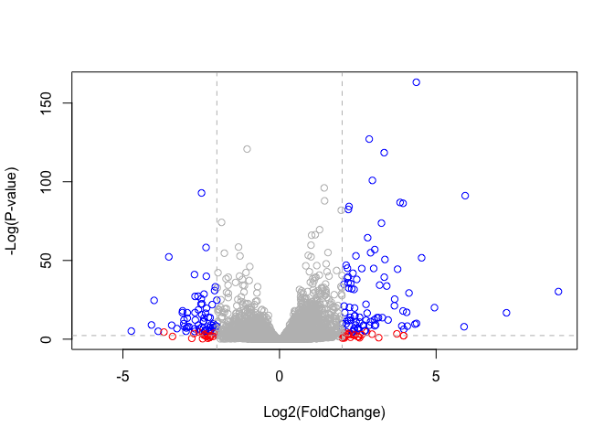

---
author:
- Xinlong Wan
title: lab12
toc-title: Table of contents
---

# Load package and data

::: cell
``` {.r .cell-code}
library(BiocManager)
library(DESeq2)
```

::: {.cell-output .cell-output-stderr}
    Loading required package: S4Vectors
:::

::: {.cell-output .cell-output-stderr}
    Loading required package: stats4
:::

::: {.cell-output .cell-output-stderr}
    Loading required package: BiocGenerics
:::

::: {.cell-output .cell-output-stderr}

    Attaching package: 'BiocGenerics'
:::

::: {.cell-output .cell-output-stderr}
    The following objects are masked from 'package:stats':

        IQR, mad, sd, var, xtabs
:::

::: {.cell-output .cell-output-stderr}
    The following objects are masked from 'package:base':

        anyDuplicated, aperm, append, as.data.frame, basename, cbind,
        colnames, dirname, do.call, duplicated, eval, evalq, Filter, Find,
        get, grep, grepl, intersect, is.unsorted, lapply, Map, mapply,
        match, mget, order, paste, pmax, pmax.int, pmin, pmin.int,
        Position, rank, rbind, Reduce, rownames, sapply, setdiff, sort,
        table, tapply, union, unique, unsplit, which.max, which.min
:::

::: {.cell-output .cell-output-stderr}

    Attaching package: 'S4Vectors'
:::

::: {.cell-output .cell-output-stderr}
    The following objects are masked from 'package:base':

        expand.grid, I, unname
:::

::: {.cell-output .cell-output-stderr}
    Loading required package: IRanges
:::

::: {.cell-output .cell-output-stderr}
    Loading required package: GenomicRanges
:::

::: {.cell-output .cell-output-stderr}
    Loading required package: GenomeInfoDb
:::

::: {.cell-output .cell-output-stderr}
    Loading required package: SummarizedExperiment
:::

::: {.cell-output .cell-output-stderr}
    Loading required package: MatrixGenerics
:::

::: {.cell-output .cell-output-stderr}
    Loading required package: matrixStats
:::

::: {.cell-output .cell-output-stderr}

    Attaching package: 'MatrixGenerics'
:::

::: {.cell-output .cell-output-stderr}
    The following objects are masked from 'package:matrixStats':

        colAlls, colAnyNAs, colAnys, colAvgsPerRowSet, colCollapse,
        colCounts, colCummaxs, colCummins, colCumprods, colCumsums,
        colDiffs, colIQRDiffs, colIQRs, colLogSumExps, colMadDiffs,
        colMads, colMaxs, colMeans2, colMedians, colMins, colOrderStats,
        colProds, colQuantiles, colRanges, colRanks, colSdDiffs, colSds,
        colSums2, colTabulates, colVarDiffs, colVars, colWeightedMads,
        colWeightedMeans, colWeightedMedians, colWeightedSds,
        colWeightedVars, rowAlls, rowAnyNAs, rowAnys, rowAvgsPerColSet,
        rowCollapse, rowCounts, rowCummaxs, rowCummins, rowCumprods,
        rowCumsums, rowDiffs, rowIQRDiffs, rowIQRs, rowLogSumExps,
        rowMadDiffs, rowMads, rowMaxs, rowMeans2, rowMedians, rowMins,
        rowOrderStats, rowProds, rowQuantiles, rowRanges, rowRanks,
        rowSdDiffs, rowSds, rowSums2, rowTabulates, rowVarDiffs, rowVars,
        rowWeightedMads, rowWeightedMeans, rowWeightedMedians,
        rowWeightedSds, rowWeightedVars
:::

::: {.cell-output .cell-output-stderr}
    Loading required package: Biobase
:::

::: {.cell-output .cell-output-stderr}
    Welcome to Bioconductor

        Vignettes contain introductory material; view with
        'browseVignettes()'. To cite Bioconductor, see
        'citation("Biobase")', and for packages 'citation("pkgname")'.
:::

::: {.cell-output .cell-output-stderr}

    Attaching package: 'Biobase'
:::

::: {.cell-output .cell-output-stderr}
    The following object is masked from 'package:MatrixGenerics':

        rowMedians
:::

::: {.cell-output .cell-output-stderr}
    The following objects are masked from 'package:matrixStats':

        anyMissing, rowMedians
:::

``` {.r .cell-code}
counts <- read.csv("airway_scaledcounts.csv", row.names=1)
metadata <-  read.csv("airway_metadata.csv")

head(counts)
```

::: {.cell-output .cell-output-stdout}
                    SRR1039508 SRR1039509 SRR1039512 SRR1039513 SRR1039516
    ENSG00000000003        723        486        904        445       1170
    ENSG00000000005          0          0          0          0          0
    ENSG00000000419        467        523        616        371        582
    ENSG00000000457        347        258        364        237        318
    ENSG00000000460         96         81         73         66        118
    ENSG00000000938          0          0          1          0          2
                    SRR1039517 SRR1039520 SRR1039521
    ENSG00000000003       1097        806        604
    ENSG00000000005          0          0          0
    ENSG00000000419        781        417        509
    ENSG00000000457        447        330        324
    ENSG00000000460         94        102         74
    ENSG00000000938          0          0          0
:::
:::

> Q1.

::: cell
``` {.r .cell-code}
print(paste(nrow(counts), 'genes'))
```

::: {.cell-output .cell-output-stdout}
    [1] "38694 genes"
:::
:::

> Q2.

::: cell
``` {.r .cell-code}
print(paste(nrow(metadata[metadata$dex=='control',]), 'control cell lines'))
```

::: {.cell-output .cell-output-stdout}
    [1] "4 control cell lines"
:::
:::

# Toy differential gene expression

::: cell
``` {.r .cell-code}
control <- metadata[metadata[,"dex"]=="control",]
control.counts <- counts[ ,control$id]
control.mean <- rowSums( control.counts )/4 
head(control.mean)
```

::: {.cell-output .cell-output-stdout}
    ENSG00000000003 ENSG00000000005 ENSG00000000419 ENSG00000000457 ENSG00000000460 
             900.75            0.00          520.50          339.75           97.25 
    ENSG00000000938 
               0.75 
:::
:::

> Q3.

Change the hardcoded "4" to be the number of genes.

::: cell
``` {.r .cell-code}
control <- metadata[metadata[,"dex"]=="control",]
control.counts <- counts[ ,control$id]
control.mean <- rowSums( control.counts )/nrow(control)
head(control.mean)
```

::: {.cell-output .cell-output-stdout}
    ENSG00000000003 ENSG00000000005 ENSG00000000419 ENSG00000000457 ENSG00000000460 
             900.75            0.00          520.50          339.75           97.25 
    ENSG00000000938 
               0.75 
:::
:::

> Q4.

::: cell
``` {.r .cell-code}
treated <- metadata[metadata[,"dex"]=="treated",]
treated.counts <- counts[ ,treated$id]
treated.mean <- rowSums( treated.counts )/nrow(treated)
head(treated.mean)
```

::: {.cell-output .cell-output-stdout}
    ENSG00000000003 ENSG00000000005 ENSG00000000419 ENSG00000000457 ENSG00000000460 
             658.00            0.00          546.00          316.50           78.75 
    ENSG00000000938 
               0.00 
:::
:::

::: cell
``` {.r .cell-code}
# combine 
meancounts <- data.frame(control.mean, treated.mean)
colSums(meancounts)
```

::: {.cell-output .cell-output-stdout}
    control.mean treated.mean 
        23005324     22196524 
:::
:::

> Q5.

::: cell
``` {.r .cell-code}
plot(meancounts)
```

::: cell-output-display

:::
:::

> Q5(b)

::: cell
``` {.r .cell-code}
library(ggplot2)
ggplot(meancounts, aes(x=control.mean, y=treated.mean))+
  geom_point()
```

::: cell-output-display

:::
:::

> Q6.

::: cell
``` {.r .cell-code}
ggplot(meancounts, aes(x=control.mean, y=treated.mean))+
  geom_point() +
  scale_x_continuous(trans="log2") +
  scale_y_continuous(trans="log2") +
  labs(x='log Control', y= 'log Treated')
```

::: {.cell-output .cell-output-stderr}
    Warning: Transformation introduced infinite values in continuous x-axis
:::

::: {.cell-output .cell-output-stderr}
    Warning: Transformation introduced infinite values in continuous y-axis
:::

::: cell-output-display

:::
:::

::: cell
``` {.r .cell-code}
meancounts$log2fc <- log2(meancounts[,"treated.mean"]/meancounts[,"control.mean"])
head(meancounts)
```

::: {.cell-output .cell-output-stdout}
                    control.mean treated.mean      log2fc
    ENSG00000000003       900.75       658.00 -0.45303916
    ENSG00000000005         0.00         0.00         NaN
    ENSG00000000419       520.50       546.00  0.06900279
    ENSG00000000457       339.75       316.50 -0.10226805
    ENSG00000000460        97.25        78.75 -0.30441833
    ENSG00000000938         0.75         0.00        -Inf
:::
:::

::: cell
``` {.r .cell-code}
zero.vals <- which(meancounts[,1:2]==0, arr.ind=TRUE)

to.rm <- unique(zero.vals[,1])
mycounts <- meancounts[-to.rm,]
head(mycounts)
```

::: {.cell-output .cell-output-stdout}
                    control.mean treated.mean      log2fc
    ENSG00000000003       900.75       658.00 -0.45303916
    ENSG00000000419       520.50       546.00  0.06900279
    ENSG00000000457       339.75       316.50 -0.10226805
    ENSG00000000460        97.25        78.75 -0.30441833
    ENSG00000000971      5219.00      6687.50  0.35769358
    ENSG00000001036      2327.00      1785.75 -0.38194109
:::
:::

> Q7.

arr.ind decides whether to return the array indices if x is an array. We
want it to be TRUE as we want to know which genes and samples have zero
counts. We are going to delete all genes that have zero count so we'll
need the row indices. Calling unique() will ensure each row will only be
counted once even if for one gene there're two samples are zero.

> Q8. 250 genes (code see below)

::: cell
``` {.r .cell-code}
up.ind <- mycounts$log2fc > 2
down.ind <- mycounts$log2fc < (-2)

nrow(mycounts[up.ind,])
```

::: {.cell-output .cell-output-stdout}
    [1] 250
:::
:::

> Q9. 367

::: cell
``` {.r .cell-code}
nrow(mycounts[down.ind,])
```

::: {.cell-output .cell-output-stdout}
    [1] 367
:::
:::

> Q10.

We shouldn't trust these results, as they are purely based on log-fold
change. The difference can be large without being statistically
significant. We need to perform statistical test to determine the
statistical significance of the difference.

# DESeq2 analysis

::: cell
``` {.r .cell-code}
library(DESeq2)
citation("DESeq2")
```

::: {.cell-output .cell-output-stdout}

    To cite package 'DESeq2' in publications use:

      Love, M.I., Huber, W., Anders, S. Moderated estimation of fold change
      and dispersion for RNA-seq data with DESeq2 Genome Biology 15(12):550
      (2014)

    A BibTeX entry for LaTeX users is

      @Article{,
        title = {Moderated estimation of fold change and dispersion for RNA-seq data with DESeq2},
        author = {Michael I. Love and Wolfgang Huber and Simon Anders},
        year = {2014},
        journal = {Genome Biology},
        doi = {10.1186/s13059-014-0550-8},
        volume = {15},
        issue = {12},
        pages = {550},
      }
:::
:::

::: cell
``` {.r .cell-code}
dds <- DESeqDataSetFromMatrix(countData=counts, 
                              colData=metadata, 
                              design=~dex)
```

::: {.cell-output .cell-output-stderr}
    converting counts to integer mode
:::

::: {.cell-output .cell-output-stderr}
    Warning in DESeqDataSet(se, design = design, ignoreRank): some variables in
    design formula are characters, converting to factors
:::

``` {.r .cell-code}
dds
```

::: {.cell-output .cell-output-stdout}
    class: DESeqDataSet 
    dim: 38694 8 
    metadata(1): version
    assays(1): counts
    rownames(38694): ENSG00000000003 ENSG00000000005 ... ENSG00000283120
      ENSG00000283123
    rowData names(0):
    colnames(8): SRR1039508 SRR1039509 ... SRR1039520 SRR1039521
    colData names(4): id dex celltype geo_id
:::
:::

::: cell
``` {.r .cell-code}
dds <- DESeq(dds)
```

::: {.cell-output .cell-output-stderr}
    estimating size factors
:::

::: {.cell-output .cell-output-stderr}
    estimating dispersions
:::

::: {.cell-output .cell-output-stderr}
    gene-wise dispersion estimates
:::

::: {.cell-output .cell-output-stderr}
    mean-dispersion relationship
:::

::: {.cell-output .cell-output-stderr}
    final dispersion estimates
:::

::: {.cell-output .cell-output-stderr}
    fitting model and testing
:::
:::

::: cell
``` {.r .cell-code}
res <- results(dds)
res <- as.data.frame(res)
head(res)
```

::: {.cell-output .cell-output-stdout}
                       baseMean log2FoldChange     lfcSE       stat     pvalue
    ENSG00000000003 747.1941954    -0.35070302 0.1682457 -2.0844697 0.03711747
    ENSG00000000005   0.0000000             NA        NA         NA         NA
    ENSG00000000419 520.1341601     0.20610777 0.1010592  2.0394752 0.04140263
    ENSG00000000457 322.6648439     0.02452695 0.1451451  0.1689823 0.86581056
    ENSG00000000460  87.6826252    -0.14714205 0.2570073 -0.5725210 0.56696907
    ENSG00000000938   0.3191666    -1.73228897 3.4936010 -0.4958463 0.62000288
                         padj
    ENSG00000000003 0.1630348
    ENSG00000000005        NA
    ENSG00000000419 0.1760317
    ENSG00000000457 0.9616942
    ENSG00000000460 0.8158486
    ENSG00000000938        NA
:::
:::

::: cell
``` {.r .cell-code}
summary(res)
```

::: {.cell-output .cell-output-stdout}
        baseMean        log2FoldChange       lfcSE            stat        
     Min.   :     0.0   Min.   :-6.030   Min.   :0.057   Min.   :-15.894  
     1st Qu.:     0.0   1st Qu.:-0.425   1st Qu.:0.174   1st Qu.: -0.643  
     Median :     1.1   Median :-0.009   Median :0.445   Median : -0.027  
     Mean   :   570.2   Mean   :-0.011   Mean   :1.136   Mean   :  0.045  
     3rd Qu.:   201.8   3rd Qu.: 0.306   3rd Qu.:1.848   3rd Qu.:  0.593  
     Max.   :329280.4   Max.   : 8.906   Max.   :3.534   Max.   : 18.422  
                        NA's   :13436    NA's   :13436   NA's   :13436    
         pvalue           padj      
     Min.   :0.000   Min.   :0.000  
     1st Qu.:0.168   1st Qu.:0.203  
     Median :0.533   Median :0.606  
     Mean   :0.495   Mean   :0.539  
     3rd Qu.:0.800   3rd Qu.:0.866  
     Max.   :1.000   Max.   :1.000  
     NA's   :13578   NA's   :23549  
:::
:::

::: cell
``` {.r .cell-code}
res05 <- results(dds, alpha=0.05)
summary(res05)
```

::: {.cell-output .cell-output-stdout}

    out of 25258 with nonzero total read count
    adjusted p-value < 0.05
    LFC > 0 (up)       : 1236, 4.9%
    LFC < 0 (down)     : 933, 3.7%
    outliers [1]       : 142, 0.56%
    low counts [2]     : 9033, 36%
    (mean count < 6)
    [1] see 'cooksCutoff' argument of ?results
    [2] see 'independentFiltering' argument of ?results
:::
:::

1.  Adding annotation data

::: cell
``` {.r .cell-code}
library("AnnotationDbi")
library("org.Hs.eg.db")
```

::: {.cell-output .cell-output-stderr}
:::
:::

::: cell
``` {.r .cell-code}
columns(org.Hs.eg.db)
```

::: {.cell-output .cell-output-stdout}
     [1] "ACCNUM"       "ALIAS"        "ENSEMBL"      "ENSEMBLPROT"  "ENSEMBLTRANS"
     [6] "ENTREZID"     "ENZYME"       "EVIDENCE"     "EVIDENCEALL"  "GENENAME"    
    [11] "GENETYPE"     "GO"           "GOALL"        "IPI"          "MAP"         
    [16] "OMIM"         "ONTOLOGY"     "ONTOLOGYALL"  "PATH"         "PFAM"        
    [21] "PMID"         "PROSITE"      "REFSEQ"       "SYMBOL"       "UCSCKG"      
    [26] "UNIPROT"     
:::
:::

::: cell
``` {.r .cell-code}
res$symbol <- mapIds(org.Hs.eg.db,
                     keys=row.names(res), # Our genenames
                     keytype="ENSEMBL",        # The format of our genenames
                     column="SYMBOL",          # The new format we want to add
                     multiVals="first")
```

::: {.cell-output .cell-output-stderr}
    'select()' returned 1:many mapping between keys and columns
:::
:::

::: cell
``` {.r .cell-code}
head(res)
```

::: {.cell-output .cell-output-stdout}
                       baseMean log2FoldChange     lfcSE       stat     pvalue
    ENSG00000000003 747.1941954    -0.35070302 0.1682457 -2.0844697 0.03711747
    ENSG00000000005   0.0000000             NA        NA         NA         NA
    ENSG00000000419 520.1341601     0.20610777 0.1010592  2.0394752 0.04140263
    ENSG00000000457 322.6648439     0.02452695 0.1451451  0.1689823 0.86581056
    ENSG00000000460  87.6826252    -0.14714205 0.2570073 -0.5725210 0.56696907
    ENSG00000000938   0.3191666    -1.73228897 3.4936010 -0.4958463 0.62000288
                         padj   symbol
    ENSG00000000003 0.1630348   TSPAN6
    ENSG00000000005        NA     TNMD
    ENSG00000000419 0.1760317     DPM1
    ENSG00000000457 0.9616942    SCYL3
    ENSG00000000460 0.8158486 C1orf112
    ENSG00000000938        NA      FGR
:::
:::

> Q11.

::: cell
``` {.r .cell-code}
res$entrez <- mapIds(org.Hs.eg.db,
                     keys=row.names(res),
                     column="ENTREZID",
                     keytype="ENSEMBL",
                     multiVals="first")
```

::: {.cell-output .cell-output-stderr}
    'select()' returned 1:many mapping between keys and columns
:::

``` {.r .cell-code}
res$uniprot <- mapIds(org.Hs.eg.db,
                     keys=row.names(res),
                     column="UNIPROT",
                     keytype="ENSEMBL",
                     multiVals="first")
```

::: {.cell-output .cell-output-stderr}
    'select()' returned 1:many mapping between keys and columns
:::

``` {.r .cell-code}
res$genename <- mapIds(org.Hs.eg.db,
                     keys=row.names(res),
                     column="GENENAME",
                     keytype="ENSEMBL",
                     multiVals="first")
```

::: {.cell-output .cell-output-stderr}
    'select()' returned 1:many mapping between keys and columns
:::

``` {.r .cell-code}
head(res)
```

::: {.cell-output .cell-output-stdout}
                       baseMean log2FoldChange     lfcSE       stat     pvalue
    ENSG00000000003 747.1941954    -0.35070302 0.1682457 -2.0844697 0.03711747
    ENSG00000000005   0.0000000             NA        NA         NA         NA
    ENSG00000000419 520.1341601     0.20610777 0.1010592  2.0394752 0.04140263
    ENSG00000000457 322.6648439     0.02452695 0.1451451  0.1689823 0.86581056
    ENSG00000000460  87.6826252    -0.14714205 0.2570073 -0.5725210 0.56696907
    ENSG00000000938   0.3191666    -1.73228897 3.4936010 -0.4958463 0.62000288
                         padj   symbol entrez    uniprot
    ENSG00000000003 0.1630348   TSPAN6   7105 A0A024RCI0
    ENSG00000000005        NA     TNMD  64102     Q9H2S6
    ENSG00000000419 0.1760317     DPM1   8813     O60762
    ENSG00000000457 0.9616942    SCYL3  57147     Q8IZE3
    ENSG00000000460 0.8158486 C1orf112  55732 A0A024R922
    ENSG00000000938        NA      FGR   2268     P09769
                                                                       genename
    ENSG00000000003                                               tetraspanin 6
    ENSG00000000005                                                 tenomodulin
    ENSG00000000419 dolichyl-phosphate mannosyltransferase subunit 1, catalytic
    ENSG00000000457                                    SCY1 like pseudokinase 3
    ENSG00000000460                         chromosome 1 open reading frame 112
    ENSG00000000938              FGR proto-oncogene, Src family tyrosine kinase
:::
:::

::: cell
``` {.r .cell-code}
# arrange and view the results by the adjusted p-value
ord <- order( res$padj )
#View(res[ord,])
head(res[ord,])
```

::: {.cell-output .cell-output-stdout}
                      baseMean log2FoldChange      lfcSE      stat       pvalue
    ENSG00000152583   954.7709       4.368359 0.23712679  18.42204 8.744898e-76
    ENSG00000179094   743.2527       2.863889 0.17556931  16.31201 8.107836e-60
    ENSG00000116584  2277.9135      -1.034701 0.06509844 -15.89440 6.928546e-57
    ENSG00000189221  2383.7537       3.341544 0.21240579  15.73189 9.144326e-56
    ENSG00000120129  3440.7038       2.965211 0.20369513  14.55710 5.264243e-48
    ENSG00000148175 13493.9204       1.427168 0.10038904  14.21638 7.251278e-46
                            padj  symbol entrez    uniprot
    ENSG00000152583 1.324415e-71 SPARCL1   8404 A0A024RDE1
    ENSG00000179094 6.139658e-56    PER1   5187     O15534
    ENSG00000116584 3.497761e-53 ARHGEF2   9181     Q92974
    ENSG00000189221 3.462270e-52    MAOA   4128     P21397
    ENSG00000120129 1.594539e-44   DUSP1   1843     B4DU40
    ENSG00000148175 1.830344e-42    STOM   2040     F8VSL7
                                                        genename
    ENSG00000152583                                 SPARC like 1
    ENSG00000179094                 period circadian regulator 1
    ENSG00000116584 Rho/Rac guanine nucleotide exchange factor 2
    ENSG00000189221                          monoamine oxidase A
    ENSG00000120129               dual specificity phosphatase 1
    ENSG00000148175                                     stomatin
:::
:::

write and save it to csv

::: cell
``` {.r .cell-code}
write.csv(res[ord,], "deseq_results.csv")
```
:::

# Data Visualization

::: cell
``` {.r .cell-code}
# volcano plot
plot( res$log2FoldChange,  -log(res$padj), 
      xlab="Log2(FoldChange)",
      ylab="-Log(P-value)")
```

::: cell-output-display

:::
:::

::: cell
``` {.r .cell-code}
plot( res$log2FoldChange,  -log(res$padj), 
 ylab="-Log(P-value)", xlab="Log2(FoldChange)")

# Add some cut-off lines
abline(v=c(-2,2), col="darkgray", lty=2)
abline(h=-log(0.05), col="darkgray", lty=2)
```

::: cell-output-display

:::
:::

::: cell
``` {.r .cell-code}
# Setup our custom point color vector 
mycols <- rep("gray", nrow(res))
mycols[ abs(res$log2FoldChange) > 2 ]  <- "red" 

inds <- (res$padj < 0.01) & (abs(res$log2FoldChange) > 2 )
mycols[ inds ] <- "blue"

# Volcano plot with custom colors 
plot( res$log2FoldChange,  -log(res$padj), 
 col=mycols, ylab="-Log(P-value)", xlab="Log2(FoldChange)" )

# Cut-off lines
abline(v=c(-2,2), col="gray", lty=2)
abline(h=-log(0.1), col="gray", lty=2)
```

::: cell-output-display

:::
:::

::: cell
``` {.r .cell-code}
library(EnhancedVolcano)
```

::: {.cell-output .cell-output-stderr}
    Loading required package: ggrepel
:::

``` {.r .cell-code}
x <- as.data.frame(res)

EnhancedVolcano(x,
    lab = x$symbol,
    x = 'log2FoldChange',
    y = 'pvalue')
```

::: cell-output-display

:::
:::

# Pathway analysis

Now we can load the packages and setup the KEGG data-sets we need. The
gageData package has pre-compiled databases mapping genes to KEGG
pathways and GO terms for common organisms. kegg.sets.hs is a named list
of 229 elements. Each element is a character vector of member gene
Entrez IDs for a single KEGG pathway.

::: cell
``` {.r .cell-code}
library(pathview)
```

::: {.cell-output .cell-output-stderr}
    ##############################################################################
    Pathview is an open source software package distributed under GNU General
    Public License version 3 (GPLv3). Details of GPLv3 is available at
    http://www.gnu.org/licenses/gpl-3.0.html. Particullary, users are required to
    formally cite the original Pathview paper (not just mention it) in publications
    or products. For details, do citation("pathview") within R.

    The pathview downloads and uses KEGG data. Non-academic uses may require a KEGG
    license agreement (details at http://www.kegg.jp/kegg/legal.html).
    ##############################################################################
:::

``` {.r .cell-code}
library(gage)
```

::: {.cell-output .cell-output-stderr}
:::

``` {.r .cell-code}
library(gageData)

data(kegg.sets.hs)

# Examine the first 2 pathways in this kegg set for humans
head(kegg.sets.hs, 2)
```

::: {.cell-output .cell-output-stdout}
    $`hsa00232 Caffeine metabolism`
    [1] "10"   "1544" "1548" "1549" "1553" "7498" "9"   

    $`hsa00983 Drug metabolism - other enzymes`
     [1] "10"     "1066"   "10720"  "10941"  "151531" "1548"   "1549"   "1551"  
     [9] "1553"   "1576"   "1577"   "1806"   "1807"   "1890"   "221223" "2990"  
    [17] "3251"   "3614"   "3615"   "3704"   "51733"  "54490"  "54575"  "54576" 
    [25] "54577"  "54578"  "54579"  "54600"  "54657"  "54658"  "54659"  "54963" 
    [33] "574537" "64816"  "7083"   "7084"   "7172"   "7363"   "7364"   "7365"  
    [41] "7366"   "7367"   "7371"   "7372"   "7378"   "7498"   "79799"  "83549" 
    [49] "8824"   "8833"   "9"      "978"   
:::
:::

gage() function requires a **named** vector of fold changes.

::: cell
``` {.r .cell-code}
foldchanges = res$log2FoldChange
names(foldchanges) = res$entrez
head(foldchanges)
```

::: {.cell-output .cell-output-stdout}
           7105       64102        8813       57147       55732        2268 
    -0.35070302          NA  0.20610777  0.02452695 -0.14714205 -1.73228897 
:::
:::

::: cell
``` {.r .cell-code}
# Get the results
keggres = gage(foldchanges, gsets=kegg.sets.hs)
```
:::

::: cell
``` {.r .cell-code}
attributes(keggres)
```

::: {.cell-output .cell-output-stdout}
    $names
    [1] "greater" "less"    "stats"  
:::
:::

::: cell
``` {.r .cell-code}
# Look at the first three down (less) pathways
head(keggres$less, 3)
```

::: {.cell-output .cell-output-stdout}
                                          p.geomean stat.mean        p.val
    hsa05332 Graft-versus-host disease 0.0004250461 -3.473346 0.0004250461
    hsa04940 Type I diabetes mellitus  0.0017820293 -3.002352 0.0017820293
    hsa05310 Asthma                    0.0020045888 -3.009050 0.0020045888
                                            q.val set.size         exp1
    hsa05332 Graft-versus-host disease 0.09053483       40 0.0004250461
    hsa04940 Type I diabetes mellitus  0.14232581       42 0.0017820293
    hsa05310 Asthma                    0.14232581       29 0.0020045888
:::
:::

Visualize the pathway

::: cell
``` {.r .cell-code}
pathview(gene.data=foldchanges, pathway.id="hsa05310")
```

::: {.cell-output .cell-output-stderr}
    'select()' returned 1:1 mapping between keys and columns
:::

::: {.cell-output .cell-output-stderr}
    Info: Working in directory /Users/ritawan/Documents/Win22/BIMM143/bimm143/class12
:::

::: {.cell-output .cell-output-stderr}
    Info: Writing image file hsa05310.pathview.png
:::
:::

::: cell
``` {.r .cell-code}
# A different PDF based output of the same data
pathview(gene.data=foldchanges, pathway.id="hsa05310", kegg.native=FALSE)
```

::: {.cell-output .cell-output-stderr}
    'select()' returned 1:1 mapping between keys and columns
:::

::: {.cell-output .cell-output-stderr}
    Info: Working in directory /Users/ritawan/Documents/Win22/BIMM143/bimm143/class12
:::

::: {.cell-output .cell-output-stderr}
    Info: Writing image file hsa05310.pathview.pdf
:::
:::


> Q12.

::: cell
``` {.r .cell-code}
# get the id of the top 2 downregulated pathways

# Look at the first three down (less) pathways
head(keggres$less, 2)
```

::: {.cell-output .cell-output-stdout}
                                          p.geomean stat.mean        p.val
    hsa05332 Graft-versus-host disease 0.0004250461 -3.473346 0.0004250461
    hsa04940 Type I diabetes mellitus  0.0017820293 -3.002352 0.0017820293
                                            q.val set.size         exp1
    hsa05332 Graft-versus-host disease 0.09053483       40 0.0004250461
    hsa04940 Type I diabetes mellitus  0.14232581       42 0.0017820293
:::
:::

::: cell
``` {.r .cell-code}
pathview(gene.data=foldchanges, pathway.id=c('hsa04940', 'hsa05332'))
```

::: {.cell-output .cell-output-stderr}
    'select()' returned 1:1 mapping between keys and columns
:::

::: {.cell-output .cell-output-stderr}
    Info: Working in directory /Users/ritawan/Documents/Win22/BIMM143/bimm143/class12
:::

::: {.cell-output .cell-output-stderr}
    Info: Writing image file hsa04940.pathview.png
:::

::: {.cell-output .cell-output-stderr}
    'select()' returned 1:1 mapping between keys and columns
:::

::: {.cell-output .cell-output-stderr}
    Info: Working in directory /Users/ritawan/Documents/Win22/BIMM143/bimm143/class12
:::

::: {.cell-output .cell-output-stderr}
    Info: Writing image file hsa05332.pathview.png
:::
:::


::: cell
``` {.r .cell-code}
sessionInfo()
```

::: {.cell-output .cell-output-stdout}
    R version 4.2.2 (2022-10-31)
    Platform: aarch64-apple-darwin20 (64-bit)
    Running under: macOS Monterey 12.5

    Matrix products: default
    BLAS:   /Library/Frameworks/R.framework/Versions/4.2-arm64/Resources/lib/libRblas.0.dylib
    LAPACK: /Library/Frameworks/R.framework/Versions/4.2-arm64/Resources/lib/libRlapack.dylib

    locale:
    [1] en_US.UTF-8/en_US.UTF-8/en_US.UTF-8/C/en_US.UTF-8/en_US.UTF-8

    attached base packages:
    [1] stats4    stats     graphics  grDevices utils     datasets  methods  
    [8] base     

    other attached packages:
     [1] gageData_2.36.0             gage_2.48.0                
     [3] pathview_1.38.0             EnhancedVolcano_1.16.0     
     [5] ggrepel_0.9.3               org.Hs.eg.db_3.16.0        
     [7] AnnotationDbi_1.60.0        ggplot2_3.4.1              
     [9] DESeq2_1.38.3               SummarizedExperiment_1.28.0
    [11] Biobase_2.58.0              MatrixGenerics_1.10.0      
    [13] matrixStats_0.63.0          GenomicRanges_1.50.2       
    [15] GenomeInfoDb_1.34.9         IRanges_2.32.0             
    [17] S4Vectors_0.36.1            BiocGenerics_0.44.0        
    [19] BiocManager_1.30.19        

    loaded via a namespace (and not attached):
     [1] httr_1.4.4             bit64_4.0.5            jsonlite_1.8.4        
     [4] blob_1.2.3             GenomeInfoDbData_1.2.9 yaml_2.3.7            
     [7] pillar_1.8.1           RSQLite_2.3.0          lattice_0.20-45       
    [10] glue_1.6.2             digest_0.6.31          RColorBrewer_1.1-3    
    [13] XVector_0.38.0         colorspace_2.1-0       htmltools_0.5.4       
    [16] Matrix_1.5-3           XML_3.99-0.13          pkgconfig_2.0.3       
    [19] zlibbioc_1.44.0        GO.db_3.16.0           xtable_1.8-4          
    [22] scales_1.2.1           BiocParallel_1.32.5    tibble_3.1.8          
    [25] annotate_1.76.0        KEGGREST_1.38.0        generics_0.1.3        
    [28] farver_2.1.1           cachem_1.0.6           withr_2.5.0           
    [31] cli_3.6.0              magrittr_2.0.3         crayon_1.5.2          
    [34] KEGGgraph_1.58.3       memoise_2.0.1          evaluate_0.20         
    [37] fansi_1.0.4            graph_1.76.0           tools_4.2.2           
    [40] lifecycle_1.0.3        munsell_0.5.0          locfit_1.5-9.7        
    [43] DelayedArray_0.24.0    Biostrings_2.66.0      compiler_4.2.2        
    [46] rlang_1.0.6            grid_4.2.2             RCurl_1.98-1.10       
    [49] rstudioapi_0.14        bitops_1.0-7           labeling_0.4.2        
    [52] rmarkdown_2.20         gtable_0.3.1           codetools_0.2-19      
    [55] DBI_1.1.3              R6_2.5.1               knitr_1.42            
    [58] dplyr_1.1.0            fastmap_1.1.0          bit_4.0.5             
    [61] utf8_1.2.3             Rgraphviz_2.42.0       parallel_4.2.2        
    [64] Rcpp_1.0.10            vctrs_0.5.2            geneplotter_1.76.0    
    [67] png_0.1-8              tidyselect_1.2.0       xfun_0.37             
:::
:::
