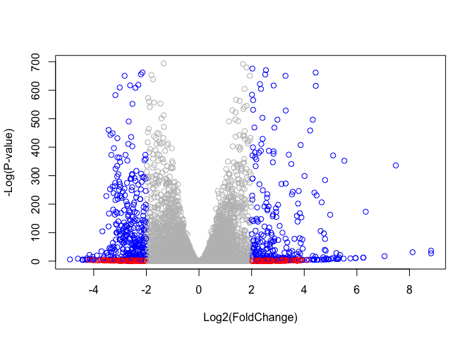

---
author:
- Xinlong Wan
title: class13
toc-title: Table of contents
---

# Differential expression

::: cell
``` {.r .cell-code}
library(DESeq2)
```

::: {.cell-output .cell-output-stderr}
    Loading required package: S4Vectors
:::

::: {.cell-output .cell-output-stderr}
    Loading required package: stats4
:::

::: {.cell-output .cell-output-stderr}
    Loading required package: BiocGenerics
:::

::: {.cell-output .cell-output-stderr}

    Attaching package: 'BiocGenerics'
:::

::: {.cell-output .cell-output-stderr}
    The following objects are masked from 'package:stats':

        IQR, mad, sd, var, xtabs
:::

::: {.cell-output .cell-output-stderr}
    The following objects are masked from 'package:base':

        anyDuplicated, aperm, append, as.data.frame, basename, cbind,
        colnames, dirname, do.call, duplicated, eval, evalq, Filter, Find,
        get, grep, grepl, intersect, is.unsorted, lapply, Map, mapply,
        match, mget, order, paste, pmax, pmax.int, pmin, pmin.int,
        Position, rank, rbind, Reduce, rownames, sapply, setdiff, sort,
        table, tapply, union, unique, unsplit, which.max, which.min
:::

::: {.cell-output .cell-output-stderr}

    Attaching package: 'S4Vectors'
:::

::: {.cell-output .cell-output-stderr}
    The following objects are masked from 'package:base':

        expand.grid, I, unname
:::

::: {.cell-output .cell-output-stderr}
    Loading required package: IRanges
:::

::: {.cell-output .cell-output-stderr}
    Loading required package: GenomicRanges
:::

::: {.cell-output .cell-output-stderr}
    Loading required package: GenomeInfoDb
:::

::: {.cell-output .cell-output-stderr}
    Loading required package: SummarizedExperiment
:::

::: {.cell-output .cell-output-stderr}
    Loading required package: MatrixGenerics
:::

::: {.cell-output .cell-output-stderr}
    Loading required package: matrixStats
:::

::: {.cell-output .cell-output-stderr}

    Attaching package: 'MatrixGenerics'
:::

::: {.cell-output .cell-output-stderr}
    The following objects are masked from 'package:matrixStats':

        colAlls, colAnyNAs, colAnys, colAvgsPerRowSet, colCollapse,
        colCounts, colCummaxs, colCummins, colCumprods, colCumsums,
        colDiffs, colIQRDiffs, colIQRs, colLogSumExps, colMadDiffs,
        colMads, colMaxs, colMeans2, colMedians, colMins, colOrderStats,
        colProds, colQuantiles, colRanges, colRanks, colSdDiffs, colSds,
        colSums2, colTabulates, colVarDiffs, colVars, colWeightedMads,
        colWeightedMeans, colWeightedMedians, colWeightedSds,
        colWeightedVars, rowAlls, rowAnyNAs, rowAnys, rowAvgsPerColSet,
        rowCollapse, rowCounts, rowCummaxs, rowCummins, rowCumprods,
        rowCumsums, rowDiffs, rowIQRDiffs, rowIQRs, rowLogSumExps,
        rowMadDiffs, rowMads, rowMaxs, rowMeans2, rowMedians, rowMins,
        rowOrderStats, rowProds, rowQuantiles, rowRanges, rowRanks,
        rowSdDiffs, rowSds, rowSums2, rowTabulates, rowVarDiffs, rowVars,
        rowWeightedMads, rowWeightedMeans, rowWeightedMedians,
        rowWeightedSds, rowWeightedVars
:::

::: {.cell-output .cell-output-stderr}
    Loading required package: Biobase
:::

::: {.cell-output .cell-output-stderr}
    Welcome to Bioconductor

        Vignettes contain introductory material; view with
        'browseVignettes()'. To cite Bioconductor, see
        'citation("Biobase")', and for packages 'citation("pkgname")'.
:::

::: {.cell-output .cell-output-stderr}

    Attaching package: 'Biobase'
:::

::: {.cell-output .cell-output-stderr}
    The following object is masked from 'package:MatrixGenerics':

        rowMedians
:::

::: {.cell-output .cell-output-stderr}
    The following objects are masked from 'package:matrixStats':

        anyMissing, rowMedians
:::

``` {.r .cell-code}
countFile<- "https://bioboot.github.io/bimm143_W18/class-material/GSE37704_featurecounts.csv"
metaFile  <- "https://bioboot.github.io/bimm143_W18/class-material/GSE37704_metadata.csv"

# Import metadata and take a peak
colData = read.csv(metaFile, row.names=1)
head(colData)
```

::: {.cell-output .cell-output-stdout}
                  condition
    SRR493366 control_sirna
    SRR493367 control_sirna
    SRR493368 control_sirna
    SRR493369      hoxa1_kd
    SRR493370      hoxa1_kd
    SRR493371      hoxa1_kd
:::

``` {.r .cell-code}
# Import countdata
countData = read.csv(countFile, row.names=1)
head(countData)
```

::: {.cell-output .cell-output-stdout}
                    length SRR493366 SRR493367 SRR493368 SRR493369 SRR493370
    ENSG00000186092    918         0         0         0         0         0
    ENSG00000279928    718         0         0         0         0         0
    ENSG00000279457   1982        23        28        29        29        28
    ENSG00000278566    939         0         0         0         0         0
    ENSG00000273547    939         0         0         0         0         0
    ENSG00000187634   3214       124       123       205       207       212
                    SRR493371
    ENSG00000186092         0
    ENSG00000279928         0
    ENSG00000279457        46
    ENSG00000278566         0
    ENSG00000273547         0
    ENSG00000187634       258
:::
:::

> Q.  

::: cell
``` {.r .cell-code}
# Note we need to remove the odd first $length col
countData <- as.matrix(countData[,-1])
head(countData)
```

::: {.cell-output .cell-output-stdout}
                    SRR493366 SRR493367 SRR493368 SRR493369 SRR493370 SRR493371
    ENSG00000186092         0         0         0         0         0         0
    ENSG00000279928         0         0         0         0         0         0
    ENSG00000279457        23        28        29        29        28        46
    ENSG00000278566         0         0         0         0         0         0
    ENSG00000273547         0         0         0         0         0         0
    ENSG00000187634       124       123       205       207       212       258
:::
:::

> Q

::: cell
``` {.r .cell-code}
# Filter count data where you have 0 read count across all samples.
countData = countData[!rowSums(countData)==0, ]
head(countData)
```

::: {.cell-output .cell-output-stdout}
                    SRR493366 SRR493367 SRR493368 SRR493369 SRR493370 SRR493371
    ENSG00000279457        23        28        29        29        28        46
    ENSG00000187634       124       123       205       207       212       258
    ENSG00000188976      1637      1831      2383      1226      1326      1504
    ENSG00000187961       120       153       180       236       255       357
    ENSG00000187583        24        48        65        44        48        64
    ENSG00000187642         4         9        16        14        16        16
:::
:::

# Running DESeq2

::: cell
``` {.r .cell-code}
dds = DESeqDataSetFromMatrix(countData=countData,
                             colData=colData,
                             design=~condition)
```

::: {.cell-output .cell-output-stderr}
    Warning in DESeqDataSet(se, design = design, ignoreRank): some variables in
    design formula are characters, converting to factors
:::

``` {.r .cell-code}
dds = DESeq(dds)
```

::: {.cell-output .cell-output-stderr}
    estimating size factors
:::

::: {.cell-output .cell-output-stderr}
    estimating dispersions
:::

::: {.cell-output .cell-output-stderr}
    gene-wise dispersion estimates
:::

::: {.cell-output .cell-output-stderr}
    mean-dispersion relationship
:::

::: {.cell-output .cell-output-stderr}
    final dispersion estimates
:::

::: {.cell-output .cell-output-stderr}
    fitting model and testing
:::
:::

::: cell
``` {.r .cell-code}
dds
```

::: {.cell-output .cell-output-stdout}
    class: DESeqDataSet 
    dim: 15975 6 
    metadata(1): version
    assays(4): counts mu H cooks
    rownames(15975): ENSG00000279457 ENSG00000187634 ... ENSG00000276345
      ENSG00000271254
    rowData names(22): baseMean baseVar ... deviance maxCooks
    colnames(6): SRR493366 SRR493367 ... SRR493370 SRR493371
    colData names(2): condition sizeFactor
:::
:::

::: cell
``` {.r .cell-code}
res = results(dds, contrast=c("condition", "hoxa1_kd", "control_sirna"))
```
:::

> Q.  

::: cell
``` {.r .cell-code}
summary(res)
```

::: {.cell-output .cell-output-stdout}

    out of 15975 with nonzero total read count
    adjusted p-value < 0.1
    LFC > 0 (up)       : 4349, 27%
    LFC < 0 (down)     : 4396, 28%
    outliers [1]       : 0, 0%
    low counts [2]     : 1237, 7.7%
    (mean count < 0)
    [1] see 'cooksCutoff' argument of ?results
    [2] see 'independentFiltering' argument of ?results
:::
:::

::: cell
``` {.r .cell-code}
plot( res$log2FoldChange, -log(res$padj) )
```

::: cell-output-display

:::
:::

> Q.  

::: cell
``` {.r .cell-code}
# Make a color vector for all genes
mycols <- rep("gray", nrow(res) )

# Color red the genes with absolute fold change above 2
mycols[ abs(res$log2FoldChange) > 2 ] <- "red"

# Color blue those with adjusted p-value less than 0.01
#  and absolute fold change more than 2
inds <- (res$pvalue<0.01) & (abs(res$log2FoldChange) > 2 )
mycols[ inds ] <- "blue"

plot( res$log2FoldChange, -log(res$padj), col=mycols, xlab="Log2(FoldChange)", ylab="-Log(P-value)" )
```

::: cell-output-display

:::
:::

# Adding gene annotation

::: cell
``` {.r .cell-code}
library("AnnotationDbi")
library("org.Hs.eg.db")
```

::: {.cell-output .cell-output-stderr}
:::

``` {.r .cell-code}
columns(org.Hs.eg.db)
```

::: {.cell-output .cell-output-stdout}
     [1] "ACCNUM"       "ALIAS"        "ENSEMBL"      "ENSEMBLPROT"  "ENSEMBLTRANS"
     [6] "ENTREZID"     "ENZYME"       "EVIDENCE"     "EVIDENCEALL"  "GENENAME"    
    [11] "GENETYPE"     "GO"           "GOALL"        "IPI"          "MAP"         
    [16] "OMIM"         "ONTOLOGY"     "ONTOLOGYALL"  "PATH"         "PFAM"        
    [21] "PMID"         "PROSITE"      "REFSEQ"       "SYMBOL"       "UCSCKG"      
    [26] "UNIPROT"     
:::

``` {.r .cell-code}
res$symbol = mapIds(org.Hs.eg.db,
                    keys=row.names(res), 
                    keytype="ENSEMBL",
                    column='SYMBOL',
                    multiVals="first")
```

::: {.cell-output .cell-output-stderr}
    'select()' returned 1:many mapping between keys and columns
:::

``` {.r .cell-code}
res$entrez = mapIds(org.Hs.eg.db,
                    keys=row.names(res),
                    keytype="ENSEMBL",
                    column="ENTREZID",
                    multiVals="first")
```

::: {.cell-output .cell-output-stderr}
    'select()' returned 1:many mapping between keys and columns
:::

``` {.r .cell-code}
res$name =   mapIds(org.Hs.eg.db,
                    keys=row.names(res),
                    keytype='ENSEMBL',
                    column='GENENAME',
                    multiVals="first")
```

::: {.cell-output .cell-output-stderr}
    'select()' returned 1:many mapping between keys and columns
:::

``` {.r .cell-code}
head(res, 10)
```

::: {.cell-output .cell-output-stdout}
    log2 fold change (MLE): condition hoxa1_kd vs control_sirna 
    Wald test p-value: condition hoxa1 kd vs control sirna 
    DataFrame with 10 rows and 9 columns
                       baseMean log2FoldChange     lfcSE       stat      pvalue
                      <numeric>      <numeric> <numeric>  <numeric>   <numeric>
    ENSG00000279457   29.913579      0.1792571 0.3248216   0.551863 5.81042e-01
    ENSG00000187634  183.229650      0.4264571 0.1402658   3.040350 2.36304e-03
    ENSG00000188976 1651.188076     -0.6927205 0.0548465 -12.630158 1.43989e-36
    ENSG00000187961  209.637938      0.7297556 0.1318599   5.534326 3.12428e-08
    ENSG00000187583   47.255123      0.0405765 0.2718928   0.149237 8.81366e-01
    ENSG00000187642   11.979750      0.5428105 0.5215599   1.040744 2.97994e-01
    ENSG00000188290  108.922128      2.0570638 0.1969053  10.446970 1.51282e-25
    ENSG00000187608  350.716868      0.2573837 0.1027266   2.505522 1.22271e-02
    ENSG00000188157 9128.439422      0.3899088 0.0467163   8.346304 7.04321e-17
    ENSG00000237330    0.158192      0.7859552 4.0804729   0.192614 8.47261e-01
                           padj      symbol      entrez                   name
                      <numeric> <character> <character>            <character>
    ENSG00000279457 6.86555e-01          NA          NA                     NA
    ENSG00000187634 5.15718e-03      SAMD11      148398 sterile alpha motif ..
    ENSG00000188976 1.76549e-35       NOC2L       26155 NOC2 like nucleolar ..
    ENSG00000187961 1.13413e-07      KLHL17      339451 kelch like family me..
    ENSG00000187583 9.19031e-01     PLEKHN1       84069 pleckstrin homology ..
    ENSG00000187642 4.03379e-01       PERM1       84808 PPARGC1 and ESRR ind..
    ENSG00000188290 1.30538e-24        HES4       57801 hes family bHLH tran..
    ENSG00000187608 2.37452e-02       ISG15        9636 ISG15 ubiquitin like..
    ENSG00000188157 4.21963e-16        AGRN      375790                  agrin
    ENSG00000237330          NA      RNF223      401934 ring finger protein ..
:::
:::

> Q.  

::: cell
``` {.r .cell-code}
res = res[order(res$pvalue),]
write.csv(res, file ="deseq_results.csv")
```
:::

# Pathway

::: cell
``` {.r .cell-code}
library(pathview)
```

::: {.cell-output .cell-output-stderr}
    ##############################################################################
    Pathview is an open source software package distributed under GNU General
    Public License version 3 (GPLv3). Details of GPLv3 is available at
    http://www.gnu.org/licenses/gpl-3.0.html. Particullary, users are required to
    formally cite the original Pathview paper (not just mention it) in publications
    or products. For details, do citation("pathview") within R.

    The pathview downloads and uses KEGG data. Non-academic uses may require a KEGG
    license agreement (details at http://www.kegg.jp/kegg/legal.html).
    ##############################################################################
:::

``` {.r .cell-code}
library(gage)
```

::: {.cell-output .cell-output-stderr}
:::

``` {.r .cell-code}
library(gageData)

data(kegg.sets.hs)
data(sigmet.idx.hs)

# Focus on signaling and metabolic pathways only
kegg.sets.hs = kegg.sets.hs[sigmet.idx.hs]

# Examine the first 3 pathways
head(kegg.sets.hs, 3)
```

::: {.cell-output .cell-output-stdout}
    $`hsa00232 Caffeine metabolism`
    [1] "10"   "1544" "1548" "1549" "1553" "7498" "9"   

    $`hsa00983 Drug metabolism - other enzymes`
     [1] "10"     "1066"   "10720"  "10941"  "151531" "1548"   "1549"   "1551"  
     [9] "1553"   "1576"   "1577"   "1806"   "1807"   "1890"   "221223" "2990"  
    [17] "3251"   "3614"   "3615"   "3704"   "51733"  "54490"  "54575"  "54576" 
    [25] "54577"  "54578"  "54579"  "54600"  "54657"  "54658"  "54659"  "54963" 
    [33] "574537" "64816"  "7083"   "7084"   "7172"   "7363"   "7364"   "7365"  
    [41] "7366"   "7367"   "7371"   "7372"   "7378"   "7498"   "79799"  "83549" 
    [49] "8824"   "8833"   "9"      "978"   

    $`hsa00230 Purine metabolism`
      [1] "100"    "10201"  "10606"  "10621"  "10622"  "10623"  "107"    "10714" 
      [9] "108"    "10846"  "109"    "111"    "11128"  "11164"  "112"    "113"   
     [17] "114"    "115"    "122481" "122622" "124583" "132"    "158"    "159"   
     [25] "1633"   "171568" "1716"   "196883" "203"    "204"    "205"    "221823"
     [33] "2272"   "22978"  "23649"  "246721" "25885"  "2618"   "26289"  "270"   
     [41] "271"    "27115"  "272"    "2766"   "2977"   "2982"   "2983"   "2984"  
     [49] "2986"   "2987"   "29922"  "3000"   "30833"  "30834"  "318"    "3251"  
     [57] "353"    "3614"   "3615"   "3704"   "377841" "471"    "4830"   "4831"  
     [65] "4832"   "4833"   "4860"   "4881"   "4882"   "4907"   "50484"  "50940" 
     [73] "51082"  "51251"  "51292"  "5136"   "5137"   "5138"   "5139"   "5140"  
     [81] "5141"   "5142"   "5143"   "5144"   "5145"   "5146"   "5147"   "5148"  
     [89] "5149"   "5150"   "5151"   "5152"   "5153"   "5158"   "5167"   "5169"  
     [97] "51728"  "5198"   "5236"   "5313"   "5315"   "53343"  "54107"  "5422"  
    [105] "5424"   "5425"   "5426"   "5427"   "5430"   "5431"   "5432"   "5433"  
    [113] "5434"   "5435"   "5436"   "5437"   "5438"   "5439"   "5440"   "5441"  
    [121] "5471"   "548644" "55276"  "5557"   "5558"   "55703"  "55811"  "55821" 
    [129] "5631"   "5634"   "56655"  "56953"  "56985"  "57804"  "58497"  "6240"  
    [137] "6241"   "64425"  "646625" "654364" "661"    "7498"   "8382"   "84172" 
    [145] "84265"  "84284"  "84618"  "8622"   "8654"   "87178"  "8833"   "9060"  
    [153] "9061"   "93034"  "953"    "9533"   "954"    "955"    "956"    "957"   
    [161] "9583"   "9615"  
:::
:::

::: cell
``` {.r .cell-code}
foldchanges = res$log2FoldChange
names(foldchanges) = res$entrez
head(foldchanges)
```

::: {.cell-output .cell-output-stdout}
         1266     54855      1465     51232      2034      2317 
    -2.422719  3.201955 -2.313738 -2.059631 -1.888019 -1.649792 
:::
:::

::: cell
``` {.r .cell-code}
# Get the results
keggres = gage(foldchanges, gsets=kegg.sets.hs)
```
:::

::: cell
``` {.r .cell-code}
attributes(keggres)
```

::: {.cell-output .cell-output-stdout}
    $names
    [1] "greater" "less"    "stats"  
:::
:::

::: cell
``` {.r .cell-code}
# Look at the first few down (less) pathways
head(keggres$less)
```

::: {.cell-output .cell-output-stdout}
                                             p.geomean stat.mean        p.val
    hsa04110 Cell cycle                   8.995727e-06 -4.378644 8.995727e-06
    hsa03030 DNA replication              9.424076e-05 -3.951803 9.424076e-05
    hsa03013 RNA transport                1.375901e-03 -3.028500 1.375901e-03
    hsa03440 Homologous recombination     3.066756e-03 -2.852899 3.066756e-03
    hsa04114 Oocyte meiosis               3.784520e-03 -2.698128 3.784520e-03
    hsa00010 Glycolysis / Gluconeogenesis 8.961413e-03 -2.405398 8.961413e-03
                                                q.val set.size         exp1
    hsa04110 Cell cycle                   0.001448312      121 8.995727e-06
    hsa03030 DNA replication              0.007586381       36 9.424076e-05
    hsa03013 RNA transport                0.073840037      144 1.375901e-03
    hsa03440 Homologous recombination     0.121861535       28 3.066756e-03
    hsa04114 Oocyte meiosis               0.121861535      102 3.784520e-03
    hsa00010 Glycolysis / Gluconeogenesis 0.212222694       53 8.961413e-03
:::
:::

::: cell
``` {.r .cell-code}
pathview(gene.data=foldchanges, pathway.id="hsa04110")
```

::: {.cell-output .cell-output-stderr}
    'select()' returned 1:1 mapping between keys and columns
:::

::: {.cell-output .cell-output-stderr}
    Info: Working in directory /Users/ritawan/Documents/Win22/BIMM143/bimm143/class13
:::

::: {.cell-output .cell-output-stderr}
    Info: Writing image file hsa04110.pathview.png
:::
:::


::: cell
``` {.r .cell-code}
## Focus on top 5 upregulated pathways here for demo purposes only
keggrespathways <- rownames(keggres$greater)[1:5]

# Extract the 8 character long IDs part of each string
keggresids = substr(keggrespathways, start=1, stop=8)
keggresids
```

::: {.cell-output .cell-output-stdout}
    [1] "hsa04640" "hsa04630" "hsa00140" "hsa04142" "hsa04330"
:::
:::

::: cell
``` {.r .cell-code}
# top 5 up-regulated
pathview(gene.data=foldchanges, pathway.id=keggresids, species="hsa")
```

::: {.cell-output .cell-output-stderr}
    'select()' returned 1:1 mapping between keys and columns
:::

::: {.cell-output .cell-output-stderr}
    Info: Working in directory /Users/ritawan/Documents/Win22/BIMM143/bimm143/class13
:::

::: {.cell-output .cell-output-stderr}
    Info: Writing image file hsa04640.pathview.png
:::

::: {.cell-output .cell-output-stderr}
    'select()' returned 1:1 mapping between keys and columns
:::

::: {.cell-output .cell-output-stderr}
    Info: Working in directory /Users/ritawan/Documents/Win22/BIMM143/bimm143/class13
:::

::: {.cell-output .cell-output-stderr}
    Info: Writing image file hsa04630.pathview.png
:::

::: {.cell-output .cell-output-stderr}
    'select()' returned 1:1 mapping between keys and columns
:::

::: {.cell-output .cell-output-stderr}
    Info: Working in directory /Users/ritawan/Documents/Win22/BIMM143/bimm143/class13
:::

::: {.cell-output .cell-output-stderr}
    Info: Writing image file hsa00140.pathview.png
:::

::: {.cell-output .cell-output-stderr}
    'select()' returned 1:1 mapping between keys and columns
:::

::: {.cell-output .cell-output-stderr}
    Info: Working in directory /Users/ritawan/Documents/Win22/BIMM143/bimm143/class13
:::

::: {.cell-output .cell-output-stderr}
    Info: Writing image file hsa04142.pathview.png
:::

::: {.cell-output .cell-output-stderr}
    Info: some node width is different from others, and hence adjusted!
:::

::: {.cell-output .cell-output-stderr}
    'select()' returned 1:1 mapping between keys and columns
:::

::: {.cell-output .cell-output-stderr}
    Info: Working in directory /Users/ritawan/Documents/Win22/BIMM143/bimm143/class13
:::

::: {.cell-output .cell-output-stderr}
    Info: Writing image file hsa04330.pathview.png
:::
:::

> Q.  

::: cell
``` {.r .cell-code}
# top 5 down-regulated
keggrespathways <- rownames(keggres$less)[1:5]

# Extract the 8 character long IDs part of each string
keggresids = substr(keggrespathways, start=1, stop=8)
keggresids
```

::: {.cell-output .cell-output-stdout}
    [1] "hsa04110" "hsa03030" "hsa03013" "hsa03440" "hsa04114"
:::

``` {.r .cell-code}
pathview(gene.data=foldchanges, pathway.id=keggresids, species="hsa")
```

::: {.cell-output .cell-output-stderr}
    'select()' returned 1:1 mapping between keys and columns
:::

::: {.cell-output .cell-output-stderr}
    Info: Working in directory /Users/ritawan/Documents/Win22/BIMM143/bimm143/class13
:::

::: {.cell-output .cell-output-stderr}
    Info: Writing image file hsa04110.pathview.png
:::

::: {.cell-output .cell-output-stderr}
    'select()' returned 1:1 mapping between keys and columns
:::

::: {.cell-output .cell-output-stderr}
    Info: Working in directory /Users/ritawan/Documents/Win22/BIMM143/bimm143/class13
:::

::: {.cell-output .cell-output-stderr}
    Info: Writing image file hsa03030.pathview.png
:::

::: {.cell-output .cell-output-stderr}
    'select()' returned 1:1 mapping between keys and columns
:::

::: {.cell-output .cell-output-stderr}
    Info: Working in directory /Users/ritawan/Documents/Win22/BIMM143/bimm143/class13
:::

::: {.cell-output .cell-output-stderr}
    Info: Writing image file hsa03013.pathview.png
:::

::: {.cell-output .cell-output-stderr}
    'select()' returned 1:1 mapping between keys and columns
:::

::: {.cell-output .cell-output-stderr}
    Info: Working in directory /Users/ritawan/Documents/Win22/BIMM143/bimm143/class13
:::

::: {.cell-output .cell-output-stderr}
    Info: Writing image file hsa03440.pathview.png
:::

::: {.cell-output .cell-output-stderr}
    'select()' returned 1:1 mapping between keys and columns
:::

::: {.cell-output .cell-output-stderr}
    Info: Working in directory /Users/ritawan/Documents/Win22/BIMM143/bimm143/class13
:::

::: {.cell-output .cell-output-stderr}
    Info: Writing image file hsa04114.pathview.png
:::
:::

# Ontology

::: cell
``` {.r .cell-code}
data(go.sets.hs)
data(go.subs.hs)

# Focus on Biological Process subset of GO
gobpsets = go.sets.hs[go.subs.hs$BP]

gobpres = gage(foldchanges, gsets=gobpsets, same.dir=TRUE)

lapply(gobpres, head)
```

::: {.cell-output .cell-output-stdout}
    $greater
                                                 p.geomean stat.mean        p.val
    GO:0007156 homophilic cell adhesion       8.519724e-05  3.824205 8.519724e-05
    GO:0002009 morphogenesis of an epithelium 1.396681e-04  3.653886 1.396681e-04
    GO:0048729 tissue morphogenesis           1.432451e-04  3.643242 1.432451e-04
    GO:0007610 behavior                       2.195494e-04  3.530241 2.195494e-04
    GO:0060562 epithelial tube morphogenesis  5.932837e-04  3.261376 5.932837e-04
    GO:0035295 tube development               5.953254e-04  3.253665 5.953254e-04
                                                  q.val set.size         exp1
    GO:0007156 homophilic cell adhesion       0.1951953      113 8.519724e-05
    GO:0002009 morphogenesis of an epithelium 0.1951953      339 1.396681e-04
    GO:0048729 tissue morphogenesis           0.1951953      424 1.432451e-04
    GO:0007610 behavior                       0.2243795      427 2.195494e-04
    GO:0060562 epithelial tube morphogenesis  0.3711390      257 5.932837e-04
    GO:0035295 tube development               0.3711390      391 5.953254e-04

    $less
                                                p.geomean stat.mean        p.val
    GO:0048285 organelle fission             1.536227e-15 -8.063910 1.536227e-15
    GO:0000280 nuclear division              4.286961e-15 -7.939217 4.286961e-15
    GO:0007067 mitosis                       4.286961e-15 -7.939217 4.286961e-15
    GO:0000087 M phase of mitotic cell cycle 1.169934e-14 -7.797496 1.169934e-14
    GO:0007059 chromosome segregation        2.028624e-11 -6.878340 2.028624e-11
    GO:0000236 mitotic prometaphase          1.729553e-10 -6.695966 1.729553e-10
                                                    q.val set.size         exp1
    GO:0048285 organelle fission             5.841698e-12      376 1.536227e-15
    GO:0000280 nuclear division              5.841698e-12      352 4.286961e-15
    GO:0007067 mitosis                       5.841698e-12      352 4.286961e-15
    GO:0000087 M phase of mitotic cell cycle 1.195672e-11      362 1.169934e-14
    GO:0007059 chromosome segregation        1.658603e-08      142 2.028624e-11
    GO:0000236 mitotic prometaphase          1.178402e-07       84 1.729553e-10

    $stats
                                              stat.mean     exp1
    GO:0007156 homophilic cell adhesion        3.824205 3.824205
    GO:0002009 morphogenesis of an epithelium  3.653886 3.653886
    GO:0048729 tissue morphogenesis            3.643242 3.643242
    GO:0007610 behavior                        3.530241 3.530241
    GO:0060562 epithelial tube morphogenesis   3.261376 3.261376
    GO:0035295 tube development                3.253665 3.253665
:::
:::

# Reactome

::: cell
``` {.r .cell-code}
sig_genes <- res[res$padj <= 0.05 & !is.na(res$padj), "symbol"]
print(paste("Total number of significant genes:", length(sig_genes)))
```

::: {.cell-output .cell-output-stdout}
    [1] "Total number of significant genes: 8147"
:::
:::

::: cell
``` {.r .cell-code}
write.table(sig_genes, file="significant_genes.txt", row.names=FALSE, col.names=FALSE, quote=FALSE)
```
:::

Then, to perform pathway analysis online go to the Reactome website
(https://reactome.org/PathwayBrowser/#TOOL=AT). Select "choose file" to
upload your significant gene list. Then, select the parameters "Project
to Humans", then click "Analyze".
