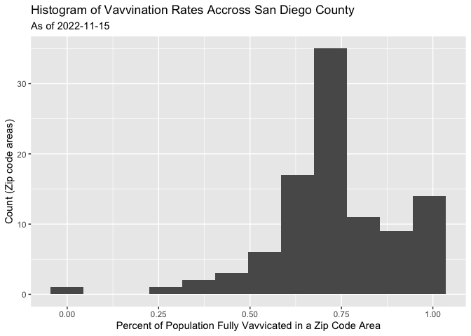
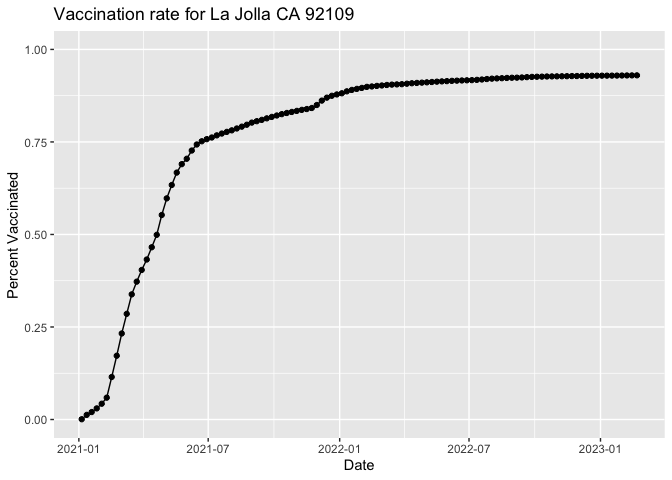
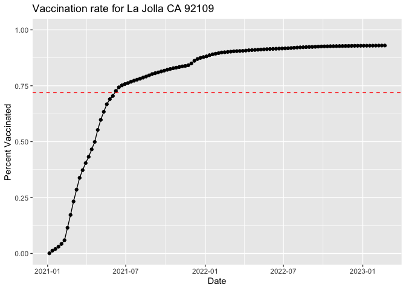
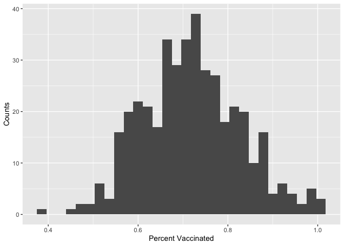
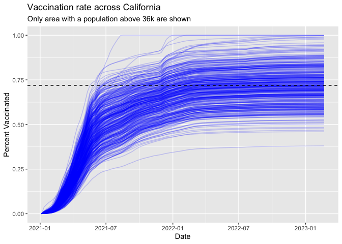

---
author:
- Xinlong Wan
title: lab17
toc-title: Table of contents
---

# Import

::: cell
``` {.r .cell-code}
url = "covid19vaccinesbyzipcode_test.csv" # data fulled from 2023-02-28

vax <- read.csv(url)
tail(vax[order(vax$as_of_date),])
```

::: {.cell-output .cell-output-stdout}
           as_of_date zip_code_tabulation_area local_health_jurisdiction
    197563 2023-02-21                    95076                Santa Cruz
    197564 2023-02-21                    93280                      Kern
    197565 2023-02-21                    93301                      Kern
    197566 2023-02-21                    95046               Santa Clara
    197567 2023-02-21                    93437             Santa Barbara
    197568 2023-02-21                    95010                Santa Cruz
                  county vaccine_equity_metric_quartile                 vem_source
    197563    Santa Cruz                              2 Healthy Places Index Score
    197564          Kern                              1 Healthy Places Index Score
    197565          Kern                              1 Healthy Places Index Score
    197566   Santa Clara                              4 Healthy Places Index Score
    197567 Santa Barbara                             NA            No VEM Assigned
    197568    Santa Cruz                              3 Healthy Places Index Score
           age12_plus_population age5_plus_population tot_population
    197563               70940.9                80312          86905
    197564               23052.1                26032          28138
    197565                9731.2                11151          12325
    197566                5087.5                 5696           5918
    197567                2494.5                 2871           3387
    197568                7602.0                 8436           8856
           persons_fully_vaccinated persons_partially_vaccinated
    197563                    68622                         6516
    197564                    13439                         1829
    197565                     7578                         1148
    197566                     5291                          336
    197567                      457                          988
    197568                     7752                          695
           percent_of_population_fully_vaccinated
    197563                               0.789621
    197564                               0.477610
    197565                               0.614848
    197566                               0.894052
    197567                               0.134928
    197568                               0.875339
           percent_of_population_partially_vaccinated
    197563                                   0.074978
    197564                                   0.065001
    197565                                   0.093144
    197566                                   0.056776
    197567                                   0.291704
    197568                                   0.078478
           percent_of_population_with_1_plus_dose booster_recip_count
    197563                               0.864599               40293
    197564                               0.542611                5768
    197565                               0.707992                3714
    197566                               0.950828                3391
    197567                               0.426632                 103
    197568                               0.953817                5600
           bivalent_dose_recip_count eligible_recipient_count redacted
    197563                     15013                    68362       No
    197564                      1132                    13418       No
    197565                      1168                     7563       No
    197566                      1267                     5276       No
    197567                        31                      456       No
    197568                      2831                     7741       No
:::
:::

> Q1 persons_fully_vaccinated

> Q2 zip_code_tabulation_area

> Q3 2021-01-05

> Q4 2023-02-21 (this report is done on 2023-02-28, the data will update
> throughout time)

::: cell
``` {.r .cell-code}
skimr::skim(vax)
```

::: cell-output-display
  -------------------------------------------------- --------
  Name                                               vax
  Number of rows                                     197568
  Number of columns                                  18
  \_\_\_\_\_\_\_\_\_\_\_\_\_\_\_\_\_\_\_\_\_\_\_     
  Column type frequency:                             
  character                                          5
  numeric                                            13
  \_\_\_\_\_\_\_\_\_\_\_\_\_\_\_\_\_\_\_\_\_\_\_\_   
  Group variables                                    None
  -------------------------------------------------- --------

  : Data summary

**Variable type: character**

  ---------------------------------------------------------------------------------------------------
  skim_variable                 n_missing   complete_rate   min   max   empty   n_unique   whitespace
  --------------------------- ----------- --------------- ----- ----- ------- ---------- ------------
  as_of_date                            0               1    10    10       0        112            0

  local_health_jurisdiction             0               1     0    15     560         62            0

  county                                0               1     0    15     560         59            0

  vem_source                            0               1    15    26       0          3            0

  redacted                              0               1     2    69       0          2            0
  ---------------------------------------------------------------------------------------------------

**Variable type: numeric**

  ----------------------------------------------------------------------------------------------------------------------------------------------------------
  skim_variable                                  n_missing   complete_rate       mean         sd      p0        p25        p50        p75       p100 hist
  -------------------------------------------- ----------- --------------- ---------- ---------- ------- ---------- ---------- ---------- ---------- -------
  zip_code_tabulation_area                               0            1.00   93665.11    1817.38   90001   92257.75   93658.50   95380.50    97635.0 ▃▅▅▇▁

  vaccine_equity_metric_quartile                      9744            0.95       2.44       1.11       1       1.00       2.00       3.00        4.0 ▇▇▁▇▇

  age12_plus_population                                  0            1.00   18895.04   18993.87       0    1346.95   13685.10   31756.12    88556.7 ▇▃▂▁▁

  age5_plus_population                                   0            1.00   20875.24   21105.97       0    1460.50   15364.00   34877.00   101902.0 ▇▃▂▁▁

  tot_population                                      9632            0.95   23372.77   22628.51      12    2126.00   18714.00   38168.00   111165.0 ▇▅▂▁▁

  persons_fully_vaccinated                           16424            0.92   13933.28   15034.25      11     927.75    8548.00   23255.00    87533.0 ▇▃▁▁▁

  persons_partially_vaccinated                       16424            0.92    1701.03    2026.98      11     165.00    1196.00    2534.00    39832.0 ▇▁▁▁▁

  percent_of_population_fully_vaccinated             20688            0.90       0.57       0.25       0       0.42       0.60       0.74        1.0 ▂▃▆▇▃

  percent_of_population_partially_vaccinated         20688            0.90       0.08       0.09       0       0.05       0.06       0.08        1.0 ▇▁▁▁▁

  percent_of_population_with_1\_plus_dose            21712            0.89       0.63       0.24       0       0.48       0.67       0.81        1.0 ▂▂▅▇▆

  booster_recip_count                                72754            0.63    5791.60    7111.11      11     295.00    2724.00    9372.75    59493.0 ▇▂▁▁▁

  bivalent_dose_recip_count                         158541            0.20    2867.36    3529.71      11     186.00    1374.00    4513.50    27175.0 ▇▂▁▁▁

  eligible_recipient_count                               0            1.00   12772.28   14887.79       0     501.00    6309.50   21926.50    87215.0 ▇▃▁▁▁
  ----------------------------------------------------------------------------------------------------------------------------------------------------------
:::
:::

> Q5 13

> Q6 16424

::: cell
``` {.r .cell-code}
1 - 0.9168691   
```

::: {.cell-output .cell-output-stdout}
    [1] 0.0831309
:::
:::

> Q7 8.31%

> Q8 Some population might not be fully registed in the medical system.

# Working with dates

::: cell
``` {.r .cell-code}
library(lubridate)
```

::: {.cell-output .cell-output-stderr}

    Attaching package: 'lubridate'
:::

::: {.cell-output .cell-output-stderr}
    The following objects are masked from 'package:base':

        date, intersect, setdiff, union
:::

``` {.r .cell-code}
today()
```

::: {.cell-output .cell-output-stdout}
    [1] "2023-03-22"
:::
:::

::: cell
``` {.r .cell-code}
# Specify that we are using the year-month-day format
vax$as_of_date <- ymd(vax$as_of_date)
```
:::

How many days have passed since the first vaccination reported in this
dataset?

::: cell
``` {.r .cell-code}
today() - vax$as_of_date[1]
```

::: {.cell-output .cell-output-stdout}
    Time difference of 806 days
:::
:::

How many days the dataset span?

::: cell
``` {.r .cell-code}
vax$as_of_date[nrow(vax)] - vax$as_of_date[1]
```

::: {.cell-output .cell-output-stdout}
    Time difference of 777 days
:::
:::

How many days have passed since the last update of the dataset?

::: cell
``` {.r .cell-code}
today()  - tail(vax$as_of_date,1)
```

::: {.cell-output .cell-output-stdout}
    Time difference of 29 days
:::
:::

> Q9 7

::: cell
``` {.r .cell-code}
length(unique(vax$as_of_date))
```

::: {.cell-output .cell-output-stdout}
    [1] 112
:::
:::

> Q10 112

# Working with ZIP codes

::: cell
``` {.r .cell-code}
library(zipcodeR)
geocode_zip('92037')
```

::: {.cell-output .cell-output-stdout}
    # A tibble: 1 × 3
      zipcode   lat   lng
      <chr>   <dbl> <dbl>
    1 92037    32.8 -117.
:::
:::

::: cell
``` {.r .cell-code}
# distance between two zip code
zip_distance('92037','92109')
```

::: {.cell-output .cell-output-stdout}
      zipcode_a zipcode_b distance
    1     92037     92109     2.33
:::
:::

::: cell
``` {.r .cell-code}
# get information from zip code
reverse_zipcode(c('92037', "92109") )
```

::: {.cell-output .cell-output-stdout}
    # A tibble: 2 × 24
      zipcode zipcode_…¹ major…² post_…³ common_c…⁴ county state   lat   lng timez…⁵
      <chr>   <chr>      <chr>   <chr>       <blob> <chr>  <chr> <dbl> <dbl> <chr>  
    1 92037   Standard   La Jol… La Jol… <raw 20 B> San D… CA     32.8 -117. Pacific
    2 92109   Standard   San Di… San Di… <raw 21 B> San D… CA     32.8 -117. Pacific
    # … with 14 more variables: radius_in_miles <dbl>, area_code_list <blob>,
    #   population <int>, population_density <dbl>, land_area_in_sqmi <dbl>,
    #   water_area_in_sqmi <dbl>, housing_units <int>,
    #   occupied_housing_units <int>, median_home_value <int>,
    #   median_household_income <int>, bounds_west <dbl>, bounds_east <dbl>,
    #   bounds_north <dbl>, bounds_south <dbl>, and abbreviated variable names
    #   ¹​zipcode_type, ²​major_city, ³​post_office_city, ⁴​common_city_list, …
:::
:::

::: cell
``` {.r .cell-code}
sd <- vax[vax$county=="San Diego", ]
length(unique(sd$zip_code_tabulation_area))
```

::: {.cell-output .cell-output-stdout}
    [1] 107
:::
:::

> Q11. 107

::: cell
``` {.r .cell-code}
sd[which.max(sd$age12_plus_population),"zip_code_tabulation_area"]
```

::: {.cell-output .cell-output-stdout}
    [1] 92154
:::
:::

> Q12 92154

::: cell
``` {.r .cell-code}
library(dplyr)
```

::: {.cell-output .cell-output-stderr}

    Attaching package: 'dplyr'
:::

::: {.cell-output .cell-output-stderr}
    The following objects are masked from 'package:stats':

        filter, lag
:::

::: {.cell-output .cell-output-stderr}
    The following objects are masked from 'package:base':

        intersect, setdiff, setequal, union
:::

``` {.r .cell-code}
sd.tmp <- filter(vax, county == "San Diego" &
                as_of_date == "2022-11-15")

mean(sd.tmp$percent_of_population_fully_vaccinated, na.rm=TRUE)
```

::: {.cell-output .cell-output-stdout}
    [1] 0.7380452
:::
:::

> Q13 73.8%

> Q14

::: cell
``` {.r .cell-code}
library(ggplot2)

sd.tmp <- filter(vax, county == "San Diego" &
                as_of_date == "2022-11-15")
ggplot(sd.tmp, aes(percent_of_population_fully_vaccinated)) +
  geom_histogram(bins=12) +
  labs(x="Percent of Population Fully Vavvicated in a Zip Code Area", 
       y="Count (Zip code areas)",
       title="Histogram of Vavvination Rates Accross San Diego County",
       subtitle = "As of 2022-11-15")
```

::: {.cell-output .cell-output-stderr}
    Warning: Removed 8 rows containing non-finite values (`stat_bin()`).
:::

::: cell-output-display

:::
:::

# focus on UCSD/La Jolla

::: cell
``` {.r .cell-code}
ucsd <- filter(sd, zip_code_tabulation_area=="92037")
ucsd[1,]$age5_plus_population
```

::: {.cell-output .cell-output-stdout}
    [1] 36144
:::
:::

> Q15.

::: cell
``` {.r .cell-code}
ucsd.graph <- ggplot(ucsd) +
  aes(as_of_date,
      percent_of_population_fully_vaccinated) +
  geom_point() +
  geom_line(group=1) +
  ylim(c(0,1)) +
  labs(x="Date", y="Percent Vaccinated", title="Vaccination rate for La Jolla CA 92109")

ucsd.graph
```

::: cell-output-display

:::
:::

# Similar size area

::: cell
``` {.r .cell-code}
# Subset to all CA areas with a population as large as 92037
vax.36 <- filter(vax, age5_plus_population > 36144 &
                as_of_date == "2022-11-15")
```
:::

> Q16.

::: cell
``` {.r .cell-code}
vax.mean <- mean(vax.36$percent_of_population_fully_vaccinated, na.rm=TRUE)
vax.mean 
```

::: {.cell-output .cell-output-stdout}
    [1] 0.7190084
:::
:::

::: cell
``` {.r .cell-code}
ucsd.graph +
  geom_hline(yintercept=vax.mean, color="red", linetype=2)
```

::: cell-output-display

:::
:::

> Q17

::: cell
``` {.r .cell-code}
summary(vax.36$percent_of_population_fully_vaccinated)
```

::: {.cell-output .cell-output-stdout}
       Min. 1st Qu.  Median    Mean 3rd Qu.    Max. 
     0.3784  0.6444  0.7163  0.7190  0.7883  1.0000 
:::
:::

> Q18

::: cell
``` {.r .cell-code}
ggplot(vax.36)+
  geom_histogram(aes(percent_of_population_fully_vaccinated)) +
  labs(x="Percent Vaccinated", y="Counts")
```

::: {.cell-output .cell-output-stderr}
    `stat_bin()` using `bins = 30`. Pick better value with `binwidth`.
:::

::: cell-output-display

:::
:::

> Q19

::: cell
``` {.r .cell-code}
vax %>% filter(as_of_date == "2022-11-15") %>%
  filter(zip_code_tabulation_area=="92040") %>%
  select(percent_of_population_fully_vaccinated)
```

::: {.cell-output .cell-output-stdout}
      percent_of_population_fully_vaccinated
    1                               0.548979
:::
:::

0.549 \< 0.719

The area 92040 is below the average.

::: cell
``` {.r .cell-code}
vax %>% filter(as_of_date == "2022-11-15") %>%
  filter(zip_code_tabulation_area=="92109") %>%
  select(percent_of_population_fully_vaccinated)
```

::: {.cell-output .cell-output-stdout}
      percent_of_population_fully_vaccinated
    1                               0.692683
:::
:::

0.693 \< 0.719

The area 92109 is below the average.

> Q20

::: cell
``` {.r .cell-code}
vax.36.all <- filter(vax, age5_plus_population>36144)

ggplot(vax.36.all) +
  aes(as_of_date,
      percent_of_population_fully_vaccinated,
      group=zip_code_tabulation_area) +
  geom_line(alpha=0.2, color="blue") +
  ylim(0.00, 1.00) +
  labs(x="Date", y="Percent Vaccinated",
title="Vaccination rate across California",
       subtitle="Only area with a population above 36k are shown") +
  geom_hline(yintercept = vax.mean, linetype=2)
```

::: {.cell-output .cell-output-stderr}
    Warning: Removed 183 rows containing missing values (`geom_line()`).
:::

::: cell-output-display

:::
:::

# About this document

::: cell
``` {.r .cell-code}
sessionInfo()
```

::: {.cell-output .cell-output-stdout}
    R version 4.2.2 (2022-10-31)
    Platform: aarch64-apple-darwin20 (64-bit)
    Running under: macOS Monterey 12.5

    Matrix products: default
    BLAS:   /Library/Frameworks/R.framework/Versions/4.2-arm64/Resources/lib/libRblas.0.dylib
    LAPACK: /Library/Frameworks/R.framework/Versions/4.2-arm64/Resources/lib/libRlapack.dylib

    locale:
    [1] en_US.UTF-8/en_US.UTF-8/en_US.UTF-8/C/en_US.UTF-8/en_US.UTF-8

    attached base packages:
    [1] stats     graphics  grDevices utils     datasets  methods   base     

    other attached packages:
    [1] ggplot2_3.4.1   dplyr_1.1.0     zipcodeR_0.3.5  lubridate_1.9.2

    loaded via a namespace (and not attached):
     [1] Rcpp_1.0.10        lattice_0.20-45    tidyr_1.3.0        class_7.3-21      
     [5] digest_0.6.31      utf8_1.2.3         R6_2.5.1           repr_1.1.6        
     [9] RSQLite_2.3.0      evaluate_0.20      e1071_1.7-13       httr_1.4.4        
    [13] pillar_1.8.1       rlang_1.0.6        curl_5.0.0         uuid_1.1-0        
    [17] rstudioapi_0.14    raster_3.6-14      blob_1.2.3         rmarkdown_2.20    
    [21] labeling_0.4.2     readr_2.1.4        stringr_1.5.0      munsell_0.5.0     
    [25] bit_4.0.5          proxy_0.4-27       compiler_4.2.2     xfun_0.37         
    [29] pkgconfig_2.0.3    tigris_2.0.1       base64enc_0.1-3    htmltools_0.5.4   
    [33] tidyselect_1.2.0   tibble_3.1.8       codetools_0.2-19   fansi_1.0.4       
    [37] crayon_1.5.2       tzdb_0.3.0         withr_2.5.0        sf_1.0-9          
    [41] tidycensus_1.3.2   rappdirs_0.3.3     grid_4.2.2         gtable_0.3.1      
    [45] jsonlite_1.8.4     lifecycle_1.0.3    DBI_1.1.3          magrittr_2.0.3    
    [49] scales_1.2.1       units_0.8-1        KernSmooth_2.23-20 cli_3.6.0         
    [53] stringi_1.7.12     cachem_1.0.6       farver_2.1.1       sp_1.6-0          
    [57] skimr_2.1.5        xml2_1.3.3         ellipsis_0.3.2     generics_0.1.3    
    [61] vctrs_0.5.2        tools_4.2.2        bit64_4.0.5        glue_1.6.2        
    [65] purrr_1.0.1        hms_1.1.2          fastmap_1.1.0      yaml_2.3.7        
    [69] colorspace_2.1-0   timechange_0.2.0   terra_1.7-3        classInt_0.4-9    
    [73] rvest_1.0.3        memoise_2.0.1      knitr_1.42        
:::
:::
