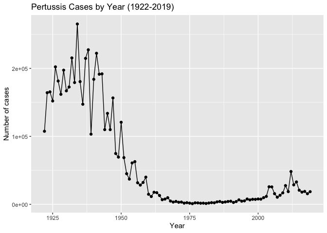
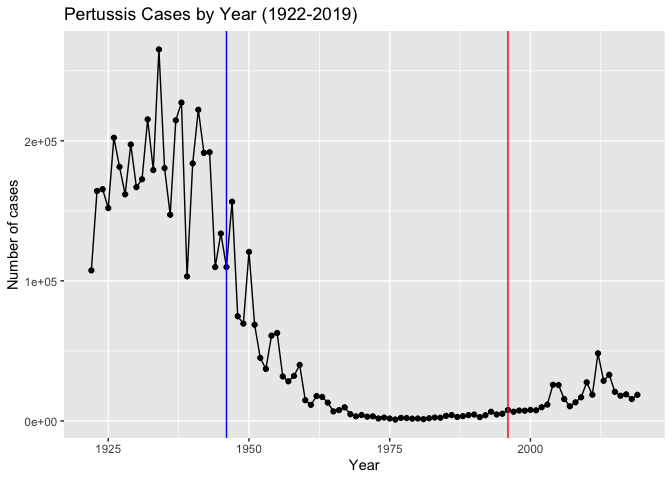
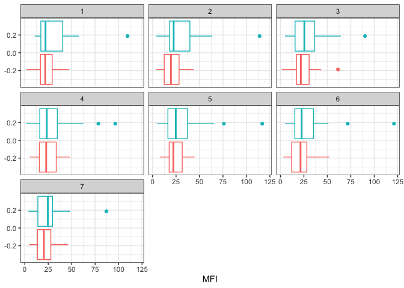
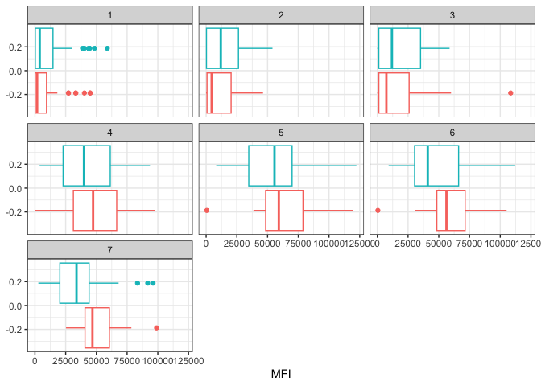
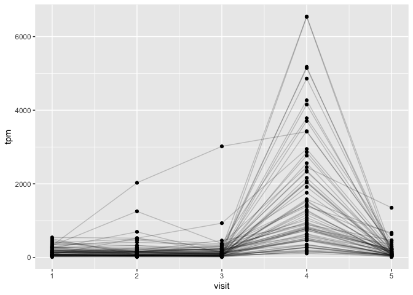
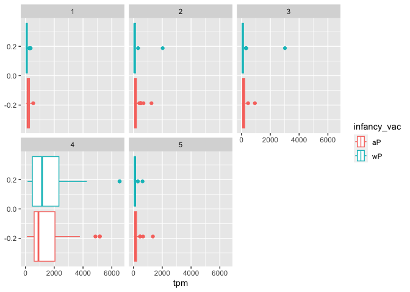

---
author:
- Xinlong Wan
title: lab19
toc-title: Table of contents
---

# Investigating pertussis cases by year

-   install datapasta
-   copy the data table to clipboard
-   in "Addins" select "paste as data.frame"

::: cell
``` {.r .cell-code}
cdc <- data.frame(
                                            Year = c(1922L,1923L,1924L,
                                                     1925L,1926L,1927L,1928L,
                                                     1929L,1930L,1931L,1932L,
                                                     1933L,1934L,1935L,1936L,
                                                     1937L,1938L,1939L,1940L,
                                                     1941L,1942L,1943L,1944L,
                                                     1945L,1946L,1947L,1948L,
                                                     1949L,1950L,1951L,
                                                     1952L,1953L,1954L,1955L,
                                                     1956L,1957L,1958L,1959L,
                                                     1960L,1961L,1962L,1963L,
                                                     1964L,1965L,1966L,1967L,
                                                     1968L,1969L,1970L,1971L,
                                                     1972L,1973L,1974L,1975L,
                                                     1976L,1977L,1978L,
                                                     1979L,1980L,1981L,1982L,
                                                     1983L,1984L,1985L,1986L,
                                                     1987L,1988L,1989L,1990L,
                                                     1991L,1992L,1993L,1994L,
                                                     1995L,1996L,1997L,1998L,
                                                     1999L,2000L,2001L,2002L,
                                                     2003L,2004L,2005L,
                                                     2006L,2007L,2008L,2009L,
                                                     2010L,2011L,2012L,2013L,
                                                     2014L,2015L,2016L,2017L,
                                                     2018L,2019L),
                    Cases = c(107473,164191,165418,
                                                     152003,202210,181411,
                                                     161799,197371,166914,172559,
                                                     215343,179135,265269,
                                                     180518,147237,214652,
                                                     227319,103188,183866,222202,
                                                     191383,191890,109873,
                                                     133792,109860,156517,74715,
                                                     69479,120718,68687,
                                                     45030,37129,60886,62786,
                                                     31732,28295,32148,40005,
                                                     14809,11468,17749,17135,
                                                     13005,6799,7717,9718,
                                                     4810,3285,4249,3036,3287,
                                                     1759,2402,1738,1010,
                                                     2177,2063,1623,1730,1248,
                                                     1895,2463,2276,3589,
                                                     4195,2823,3450,4157,4570,
                                                     2719,4083,6586,4617,
                                                     5137,7796,6564,7405,7298,
                                                     7867,7580,9771,11647,
                                                     25827,25616,15632,10454,
                                                     13278,16858,27550,18719,
                                                     48277,28639,32971,20762,
                                                     17972,18975,15609,18617)
                  )

head(cdc)
```

::: {.cell-output .cell-output-stdout}
      Year  Cases
    1 1922 107473
    2 1923 164191
    3 1924 165418
    4 1925 152003
    5 1926 202210
    6 1927 181411
:::
:::

> Q1

::: cell
``` {.r .cell-code}
library(ggplot2)
cases_plot <- ggplot(cdc) +
  aes(Year, Cases) +
  geom_point() +
  geom_line() +
  labs(x="Year",
       y="Number of cases",
       title="Pertussis Cases by Year (1922-2019)")

cases_plot
```

::: cell-output-display

:::
:::

# Two vaccines (wP & aP)

> Q2

::: cell
``` {.r .cell-code}
cases_plot + 
  geom_vline(xintercept=1996, col="red") +
  geom_vline(xintercept=1946, col="blue")
```

::: cell-output-display

:::
:::

> Q3. After the introduction of aP vaccine, the cases remain low and
> then increases. This suggests that aP is not as effective as wP, which
> could be because that ap is a simplfied version of wP. Other
> explanation could that the testing is more sensitive so that some
> cases that weren't able to detected are deteced. Also, the infection
> is from bacterial, so they could evolve and makes the vaccine less
> effective.

# CMI-PB Data

::: cell
``` {.r .cell-code}
# Allows us to read, write and process JSON data
library(jsonlite)
subject <- read_json("https://www.cmi-pb.org/api/subject", simplifyVector = TRUE) 
head(subject, 3)
```

::: {.cell-output .cell-output-stdout}
      subject_id infancy_vac biological_sex              ethnicity  race
    1          1          wP         Female Not Hispanic or Latino White
    2          2          wP         Female Not Hispanic or Latino White
    3          3          wP         Female                Unknown White
      year_of_birth date_of_boost      dataset
    1    1986-01-01    2016-09-12 2020_dataset
    2    1968-01-01    2019-01-28 2020_dataset
    3    1983-01-01    2016-10-10 2020_dataset
:::
:::

> Q4

::: cell
``` {.r .cell-code}
table(subject$infancy_vac)
```

::: {.cell-output .cell-output-stdout}

    aP wP 
    47 49 
:::
:::

> Q5

::: cell
``` {.r .cell-code}
table(subject$biological_sex)
```

::: {.cell-output .cell-output-stdout}

    Female   Male 
        66     30 
:::
:::

> Q6

::: cell
``` {.r .cell-code}
table(subject$biological_sex, subject$race)
```

::: {.cell-output .cell-output-stdout}
            
             American Indian/Alaska Native Asian Black or African American
      Female                             0    18                         2
      Male                               1     9                         0
            
             More Than One Race Native Hawaiian or Other Pacific Islander
      Female                  8                                         1
      Male                    2                                         1
            
             Unknown or Not Reported White
      Female                      10    27
      Male                         4    13
:::
:::

::: cell
``` {.r .cell-code}
library(lubridate)
```

::: {.cell-output .cell-output-stderr}

    Attaching package: 'lubridate'
:::

::: {.cell-output .cell-output-stderr}
    The following objects are masked from 'package:base':

        date, intersect, setdiff, union
:::
:::

> Q7

::: cell
``` {.r .cell-code}
subject$age <- time_length(today() - ymd(subject$year_of_birth), "years")

print(paste("the average age of wP individuals is", mean(subject[subject$infancy_vac=="wP", "age"])))
```

::: {.cell-output .cell-output-stdout}
    [1] "the average age of wP individuals is 36.3819581220579"
:::

``` {.r .cell-code}
print(paste("the average age of aP individuals is", mean(subject[subject$infancy_vac=="aP", "age"])))
```

::: {.cell-output .cell-output-stdout}
    [1] "the average age of aP individuals is 25.5375070994801"
:::

``` {.r .cell-code}
t.test(subject[subject$infancy_vac=="wP", "age"], subject[subject$infancy_vac=="aP", "age"], paired=FALSE, alternative="two.sided")
```

::: {.cell-output .cell-output-stdout}

        Welch Two Sample t-test

    data:  subject[subject$infancy_vac == "wP", "age"] and subject[subject$infancy_vac == "aP", "age"]
    t = 12.092, df = 51.082, p-value < 2.2e-16
    alternative hypothesis: true difference in means is not equal to 0
    95 percent confidence interval:
      9.044045 12.644857
    sample estimates:
    mean of x mean of y 
     36.38196  25.53751 
:::
:::

pvalue \< 0.001

Yes they are significantly different.

> Q8

::: cell
``` {.r .cell-code}
subject$age_at_boost <- time_length( ymd(subject$date_of_boost) - ymd(subject$year_of_birth), "years")

subject$age_at_boost
```

::: {.cell-output .cell-output-stdout}
     [1] 30.69678 51.07461 33.77413 28.65982 25.65914 28.77481 35.84942 34.14921
     [9] 20.56400 34.56263 30.65845 34.56263 19.56194 23.61944 27.61944 29.56331
    [17] 36.69815 19.65777 22.73511 32.26557 25.90007 23.90144 25.90007 28.91992
    [25] 42.92129 47.07461 47.07461 29.07324 21.07324 21.07324 28.15058 24.15058
    [33] 24.15058 21.14990 21.14990 31.20876 26.20671 32.20808 27.20876 26.20671
    [41] 21.20739 20.26557 22.26420 19.32375 21.32238 19.32375 19.32375 22.41752
    [49] 20.41889 21.41821 19.47707 23.47707 20.47639 21.47570 19.47707 35.65777
    [57] 33.65914 31.65777 25.73580 24.70089 28.70089 33.73580 19.73443 34.73511
    [65] 19.73443 28.73648 27.73443 19.81109 26.77344 33.81246 25.77413 19.81109
    [73] 18.85010 19.81109 31.81109 22.81177 31.84942 19.84942 18.85010 18.85010
    [81] 19.90691 18.85010 20.90897 19.04449 20.04381 19.90691 19.90691 19.00616
    [89] 19.00616 20.04381 20.04381 20.07940 21.08145 20.07940 20.07940 20.07940
:::
:::

> Q9

::: cell
``` {.r .cell-code}
ggplot(subject) +
  aes(time_length(age, "year"),
      fill=as.factor(infancy_vac)) +
  geom_histogram(show.legend=FALSE) +
  facet_wrap(vars(infancy_vac), nrow=2) 
```

::: {.cell-output .cell-output-stderr}
    `stat_bin()` using `bins = 30`. Pick better value with `binwidth`.
:::

::: cell-output-display

:::
:::

Yes they looks significantly different from the plot, as majority of
data from the two groups are not overlapping.

# Joining multiple table

::: cell
``` {.r .cell-code}
specimen <- read_json("https://www.cmi-pb.org/api//specimen", simplifyVector = TRUE) 
titer <- read_json("https://www.cmi-pb.org/api/ab_titer", simplifyVector = TRUE) 
```
:::

> Q9

::: cell
``` {.r .cell-code}
library(dplyr)
```

::: {.cell-output .cell-output-stderr}

    Attaching package: 'dplyr'
:::

::: {.cell-output .cell-output-stderr}
    The following objects are masked from 'package:stats':

        filter, lag
:::

::: {.cell-output .cell-output-stderr}
    The following objects are masked from 'package:base':

        intersect, setdiff, setequal, union
:::

``` {.r .cell-code}
meta <- left_join(specimen, subject)
```

::: {.cell-output .cell-output-stderr}
    Joining with `by = join_by(subject_id)`
:::

``` {.r .cell-code}
dim(meta)
```

::: {.cell-output .cell-output-stdout}
    [1] 729  15
:::

``` {.r .cell-code}
head(meta)
```

::: {.cell-output .cell-output-stdout}
      specimen_id subject_id actual_day_relative_to_boost
    1           1          1                           -3
    2           2          1                          736
    3           3          1                            1
    4           4          1                            3
    5           5          1                            7
    6           6          1                           11
      planned_day_relative_to_boost specimen_type visit infancy_vac biological_sex
    1                             0         Blood     1          wP         Female
    2                           736         Blood    10          wP         Female
    3                             1         Blood     2          wP         Female
    4                             3         Blood     3          wP         Female
    5                             7         Blood     4          wP         Female
    6                            14         Blood     5          wP         Female
                   ethnicity  race year_of_birth date_of_boost      dataset
    1 Not Hispanic or Latino White    1986-01-01    2016-09-12 2020_dataset
    2 Not Hispanic or Latino White    1986-01-01    2016-09-12 2020_dataset
    3 Not Hispanic or Latino White    1986-01-01    2016-09-12 2020_dataset
    4 Not Hispanic or Latino White    1986-01-01    2016-09-12 2020_dataset
    5 Not Hispanic or Latino White    1986-01-01    2016-09-12 2020_dataset
    6 Not Hispanic or Latino White    1986-01-01    2016-09-12 2020_dataset
           age age_at_boost
    1 37.21834     30.69678
    2 37.21834     30.69678
    3 37.21834     30.69678
    4 37.21834     30.69678
    5 37.21834     30.69678
    6 37.21834     30.69678
:::
:::

> Q10

::: cell
``` {.r .cell-code}
abdata <- inner_join(titer, meta)
```

::: {.cell-output .cell-output-stderr}
    Joining with `by = join_by(specimen_id)`
:::

``` {.r .cell-code}
dim(abdata)
```

::: {.cell-output .cell-output-stdout}
    [1] 32675    22
:::
:::

> Q11

::: cell
``` {.r .cell-code}
table(abdata$isotype)
```

::: {.cell-output .cell-output-stdout}

     IgE  IgG IgG1 IgG2 IgG3 IgG4 
    6698 1413 6141 6141 6141 6141 
:::
:::

> Q12

::: cell
``` {.r .cell-code}
table(abdata$visit)
```

::: {.cell-output .cell-output-stdout}

       1    2    3    4    5    6    7    8 
    5795 4640 4640 4640 4640 4320 3920   80 
:::
:::

A lot less people complete visit 8 compared to the previous 7 visits.

# Examine IgG1 Ab titer levels

::: cell
``` {.r .cell-code}
ig1 <- abdata %>% filter(isotype == "IgG1", visit!=8)
head(ig1)
```

::: {.cell-output .cell-output-stdout}
      specimen_id isotype is_antigen_specific antigen        MFI MFI_normalised
    1           1    IgG1                TRUE     ACT 274.355068      0.6928058
    2           1    IgG1                TRUE     LOS  10.974026      2.1645083
    3           1    IgG1                TRUE   FELD1   1.448796      0.8080941
    4           1    IgG1                TRUE   BETV1   0.100000      1.0000000
    5           1    IgG1                TRUE   LOLP1   0.100000      1.0000000
    6           1    IgG1                TRUE Measles  36.277417      1.6638332
       unit lower_limit_of_detection subject_id actual_day_relative_to_boost
    1 IU/ML                 3.848750          1                           -3
    2 IU/ML                 4.357917          1                           -3
    3 IU/ML                 2.699944          1                           -3
    4 IU/ML                 1.734784          1                           -3
    5 IU/ML                 2.550606          1                           -3
    6 IU/ML                 4.438966          1                           -3
      planned_day_relative_to_boost specimen_type visit infancy_vac biological_sex
    1                             0         Blood     1          wP         Female
    2                             0         Blood     1          wP         Female
    3                             0         Blood     1          wP         Female
    4                             0         Blood     1          wP         Female
    5                             0         Blood     1          wP         Female
    6                             0         Blood     1          wP         Female
                   ethnicity  race year_of_birth date_of_boost      dataset
    1 Not Hispanic or Latino White    1986-01-01    2016-09-12 2020_dataset
    2 Not Hispanic or Latino White    1986-01-01    2016-09-12 2020_dataset
    3 Not Hispanic or Latino White    1986-01-01    2016-09-12 2020_dataset
    4 Not Hispanic or Latino White    1986-01-01    2016-09-12 2020_dataset
    5 Not Hispanic or Latino White    1986-01-01    2016-09-12 2020_dataset
    6 Not Hispanic or Latino White    1986-01-01    2016-09-12 2020_dataset
           age age_at_boost
    1 37.21834     30.69678
    2 37.21834     30.69678
    3 37.21834     30.69678
    4 37.21834     30.69678
    5 37.21834     30.69678
    6 37.21834     30.69678
:::
:::

> Q13

::: cell
``` {.r .cell-code}
ggplot(ig1) +
  aes(MFI, antigen) +
  geom_boxplot() + 
  facet_wrap(vars(visit), nrow=2)
```

::: cell-output-display

:::
:::

> Q14

The antigen FIM2/3 shows the most significant difference. This antigen
is extra-cellular fimbriae proteins from B.pertussis, which is the
"effective" part of the vaccine. After injection of the vaccine, this
antigen increase in the body.

> Q15

::: cell
``` {.r .cell-code}
filter(ig1, antigen=="Measles") %>%
  ggplot() +
  aes(MFI, col=infancy_vac) +
  geom_boxplot(show.legend = FALSE) +
  facet_wrap(vars(visit)) +
  theme_bw()
```

::: cell-output-display

:::
:::

::: cell
``` {.r .cell-code}
filter(ig1, antigen=="FIM2/3") %>%
  ggplot() +
  aes(MFI, col=infancy_vac) +
  geom_boxplot(show.legend = FALSE) +
  facet_wrap(vars(visit)) +
  theme_bw()
```

::: cell-output-display

:::
:::

> Q16

Measles doesn't show a significant change overtime for both antibody.
FIM2/3 shows a increase at visit 4, continue to increase at visit 5, and
slighly decrease at visit 6 and 7, which suggesting the patient is
taking the effective part of the vaccine. The trend is consistent for
both wP and aP.

> Q17

The trend is mostly consistent for both wP and aP. For FIM2/3 after
visit 4, aP shows a higher level of response than wP, but the difference
is not large.

# Obtaining CMI-PB RNASeq data

::: cell
``` {.r .cell-code}
url <- "https://www.cmi-pb.org/api/v2/rnaseq?versioned_ensembl_gene_id=eq.ENSG00000211896.7"

rna <- read_json(url, simplifyVector = TRUE) 
ssrna <- inner_join(rna, meta)
```

::: {.cell-output .cell-output-stderr}
    Joining with `by = join_by(specimen_id)`
:::
:::

> Q18

::: cell
``` {.r .cell-code}
ggplot(ssrna) +
  aes(visit, tpm, group=subject_id) +
  geom_point() +
  geom_line(alpha=0.2)
```

::: cell-output-display

:::
:::

> Q19

The expression of this gene peaked at visit 4, which is also when FIM2/3
peaked. Suggesting cells are making more antibody to target antigen
FIM2/3.

> Q20

It matches the trend until visit 4. Afterwards, the gene expression
decreases drastically, but the antibody made by the gene stays in the
cells and continues to target FIM2/3.

::: cell
``` {.r .cell-code}
ggplot(ssrna) +
  aes(tpm, col=infancy_vac) +
  geom_boxplot() +
  facet_wrap(vars(visit))
```

::: cell-output-display

:::
:::

::: cell
``` {.r .cell-code}
ssrna %>%  
  filter(visit==4) %>% 
  ggplot() +
    aes(tpm, col=infancy_vac) + geom_density() + 
    geom_rug() 
```

::: cell-output-display

:::
:::
